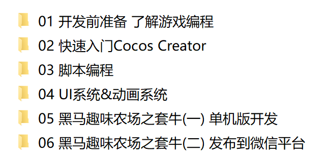

# 1 什么是游戏编程

游戏编程（Gaming Programming）是一种通过编程来实现电子游戏中的逻辑的方法，包括渲染，物理，交互等。

编程语言的选择，如C编程语言、C++、Java, JavaScript，Lua等，编写计算机、手机或游戏机上的游戏。 目 前流行的游戏编程语言为C++和JavaScript编程语言，游戏编程底层接口为DirectX、OpenGL和SDL(Simple DirectMedia Layer)等。 多媒体编程接口 主要作用是让游戏或多媒体程序获得更高的执行效率，加强3D图形和声音效果，并提供设计人员一个共同的硬件驱动标准，让游戏开发者不必为每一品牌的硬件来写不同的驱动程序，也降低用户安装及设置硬件的复杂度。 

现 在手机上玩的游戏分为Android与IOS两种平台，分别是用java和object-c(或swift)。当然时 下也流行一些跨平台的编程引擎，例如cocos creator、unity 3D等。   

* 游戏引擎是什么

  游戏引擎是指一些已编写好的可编辑电脑游戏系统或者一些交互式实时图像应用程序的核心组件。这些系统为游戏设计者提供各种编写游戏所需的各种工具，其目的在于让游戏设计者能容易和快速地做出游戏程式而不用由零开始。大部分都支持多种操作平台，如Linux、Mac OS X、微软Windows。游戏引擎包含以下系统：渲染引擎（即“渲染器”，含二维图像引擎和三维图像引擎）、物理引擎、碰撞检测系统、音效、脚本引擎、电脑动画、人工智能、网络引擎以及场景管理。 

  简单来说， 引擎可以理解为一个开发游戏用的基本框架 ，对于一些游戏开发上通用的功能，不用再重复造轮子了，拿来就用。

* 常见的游戏引擎

  **一、Unity 3D**

  Unity3D是由Unity Technologies开发的一个让玩家轻松创建诸如三维视频游戏、建筑可视化、实时三维动画等类型互动内容的多平台的综合型游戏开发工具，是一个全面整合的专业游戏引擎。

  

  代表作游戏：

1. 诛仙
2. 极限摩托车2 (Trial Xtreme 2)
3. 择天记
4. 王者荣耀
5. 神庙逃亡2（Temple Run 2）
6. 神庙逃亡：勇敢传说(Temple Run:Brave)
7. 纪念碑谷（Monument Valley）
8. 仙剑奇侠传6

**二、虚幻引擎**

**虚幻引擎的设计目的非常明确，每个方面都具有较高的易用性，尤其侧重于数据生成和程序编写的方面，这样，美工只需要程序员的很少量的协助，就能尽可能多地开发游戏的数据资源，并且这个过程是在完全可视化环境中完成的，实际操作非常便利。**


代表作游戏：

1. 《绝地求生》（PLAYERUNKNOWN’S BATTLEGROUNDS）
2. 《堡垒之夜》（Fortnight）

**三、Cry Engine 3**

Cry Engine3，是德国的CRYTEK公司出品一款对应最 新技术DirectX11的游戏引擎。2001年引入的这个“沙盒”是全球首款”所见即所玩”(WYSIWYP)游戏编辑器，现已发展到第三代，WYSIWYP功能将提升到一个全新层次，并扩展到了PS3和X360平台上，允许实时创作跨平台游戏，另外工具包内的创作工具和开发效率也都得到了全面增强。


代表作游戏：

1. 《末日之战（Crysis）》
2. 《战争前线》

**四、白鹭（Egret）**

**Egret**是一套完整的HTML5游戏开发解决方案。Egret中包含多个工具以及项目。Egret Engine是一个基于Type语言开发的HTML5游戏引擎，该项目在BSD许可证下发布。用Egret Engine开发的游戏可发布为HTML5版本，运行于浏览器之中。同时，也可以发布为iOS、Android和WindowsPhone原生程序。


**五、Cocos 2D**

Cocos2d-x是一个开源的移动2D游戏框架，MIT许可证下发布的。这是一个C++ Cocos2d-iPhone项目的版本。Cocos2d-X发展的重点是围绕Cocos2d跨平台，Cocos2d-x提供的框架。手机游戏，可以写在C++或者Lua中，使用API是Cocos2d-iPhone完全兼。Cocos2d-x项目可以很容易地建立和运行在iOS，Android，黑莓Blackberry等操作系统中。


代表作游戏：

1. 刀塔传奇
2. 捕鱼达人
3. 开心消消乐
4. 全民飞机大战
5. 梦幻西游
6. 传奇世界


本课程选择的游戏引擎和编程语言 是 Cocos2d的升级版 CocosCreator + JavaScript。

选择的理由，市场份额最大，文档资料齐全，支持多平台，包括对微信小游戏，支付宝小游戏，百度小游戏等新的游戏平台的支持。本课程主要是针对微信小游戏的开发。


# 2 整体课程安排概述

本课程主要是针对微信小游戏的开发，从入门到完成一个完整的小游戏的开发，再到整体打包发布到微信平台。

选择的游戏引擎是CocosCreator ，编程语言是JavaScript，游戏后台采用Java。

一共是6天的课程安排：




# 3 开发前的编程语言准备

学习本课程需要有一定的JavaScript基础，接下来的学习主要目的是为了了解ES6的一些新特性和为后面的游戏引擎Cocos creator 和 微信小游戏开发打下语言基础。

##  3.1 ECMAScript的背景

 JavaScript 是大家所了解的语言名称，但是这个语言名称是商标（ Oracle 公司注册的商标）。因此，JavaScript 的正式名称是 ECMAScript 。1996年11月，JavaScript 的创造者网景公司将 JS 提交给国际化标准组织 ECMA（European computer manufactures association，欧洲计算机制造联合会），希望这种语言能够成为国际标准，随后 ECMA 发布了规定浏览器脚本语言的标准，即 ECMAScript。这也有利于这门语言的开放和中立。 

## 3.2 ECMAScript 的历史

ES6 是 ECMAScript 标准十余年来变动最大的一个版本，为其添加了许多新的语法特性。

- 1997 年 ECMAScript 1.0 诞生。
- 1998 年 6 月 ECMAScript 2.0 诞生，包含一些小的更改，用于同步独立的 ISO 国际标准。
- 1999 年 12 月 ECMAScript 3.0诞生，它是一个巨大的成功，在业界得到了广泛的支持，它奠定了 JS 的基本语法，被其后版本完全继承。直到今天，我们一开始学习 JS ，其实就是在学 3.0 版的语法。
- 2000 年的 ECMAScript 4.0 是当下 ES6 的前身，但由于这个版本太过激烈，对 ES 3 做了彻底升级，所以暂时被"和谐"了。
- 2009 年 12 月，ECMAScript 5.0 版正式发布。ECMA 专家组预计 ECMAScript 的第五个版本会在 2013 年中期到 2018 年作为主流的开发标准。2011年6月，ES 5.1 版发布，并且成为 ISO 国际标准。
- 2013 年，ES6 草案冻结，不再添加新的功能，新的功能将被放到 ES7 中；2015年6月， ES6 正式通过，成为国际标准。

## 3.3 微信环境对ES6的支持

**JavaScript 支持情况**

运行限制

基于安全考虑，小程序中不支持动态执行 JS 代码，即：

- 不支持使用 `eval` 执行 JS 代码
- 不支持使用 `new Function` 创建函数

**客户端 ES6 API 支持情况**

微信小程序已经支持了绝大部分的 ES6 API，已支持的 API 如下（部分API依赖系统版本）：

| String               | iOS8 | iOS9 | iOS10 | Android |
| :------------------- | :--- | :--- | :---- | :------ |
| codePointAt          |      |      |       |         |
| normalize            | ✘    | ✘    |       |         |
| includes             |      |      |       |         |
| startsWith           |      |      |       |         |
| endsWith             |      |      |       |         |
| repeat               |      |      |       |         |
| String.fromCodePoint |      |      |       |         |

| Array      | iOS8 | iOS9 | iOS10 | Android |
| :--------- | :--- | :--- | :---- | :------ |
| copyWithin |      |      |       |         |
| find       |      |      |       |         |
| findIndex  |      |      |       |         |
| fill       |      |      |       |         |
| entries    |      |      |       |         |
| keys       |      |      |       |         |
| values     | ✘    |      |       | ✘       |
| includes   | ✘    |      |       |         |
| Array.from |      |      |       |         |
| Array.of   |      |      |       |         |

| Number        | iOS8 | iOS9 | iOS10 | Android |
| :------------ | :--- | :--- | :---- | :------ |
| isFinite      |      |      |       |         |
| isNaN         |      |      |       |         |
| parseInt      |      |      |       |         |
| parseFloat    |      |      |       |         |
| isInteger     |      |      |       |         |
| EPSILON       |      |      |       |         |
| isSafeInteger |      |      |       |         |

| Math   | iOS8 | iOS9 | iOS10 | Android |
| :----- | :--- | :--- | :---- | :------ |
| trunc  |      |      |       |         |
| sign   |      |      |       |         |
| cbrt   |      |      |       |         |
| clz32  |      |      |       |         |
| imul   |      |      |       |         |
| fround |      |      |       |         |
| hypot  |      |      |       |         |
| expm1  |      |      |       |         |
| log1p  |      |      |       |         |
| log10  |      |      |       |         |
| log2   |      |      |       |         |
| sinh   |      |      |       |         |
| cosh   |      |      |       |         |
| tanh   |      |      |       |         |
| asinh  |      |      |       |         |
| acosh  |      |      |       |         |
| atanh  |      |      |       |         |

| Object                   | iOS8 | iOS9 | iOS10 | Android |
| :----------------------- | :--- | :--- | :---- | :------ |
| is                       |      |      |       |         |
| assign                   |      |      |       |         |
| getOwnPropertyDescriptor |      |      |       |         |
| keys                     |      |      |       |         |
| getOwnPropertyNames      |      |      |       |         |
| getOwnPropertySymbols    |      |      |       |         |


| Other   | iOS8 | iOS9 | iOS10 | Android |
| :------ | :--- | :--- | :---- | :------ |
| Symbol  |      |      |       |         |
| Set     |      |      |       |         |
| Map     |      |      |       |         |
| Proxy   | ✘    | ✘    |       | ✘       |
| Reflect |      |      |       |         |
| Promise |      |      |       |         |

# 4 变量声明let与const

ES6新增加了两个重要的关键字: let 和 const，他们的作用就是用来取代var。

let 声明的变量只在 let 命令所在的代码块内有效。

const 声明一个只读的常量，一旦声明，常量的值就不能改变。

## 4.1 let的使用

**let与var的使用对比**

* 只在代码块内有效

  ```js
  for (var a = 0; a < 10; a++) {}
  console.log(a);
  // 输出结果--> 10
  
  for (let b = 0; b < 10; b++) {}
  console.log(b);
  // 输出结果--> Uncaught ReferenceError: b is not defined
  ```

* 不能重复声明

  ```js
  var a = 1;
  var a = 2;
  console.log(a)
  // 输出结果--> 2
  
  let b = 1;
  let b = 2;
  console.log(b)
  // 输出结果--> Uncaught SyntaxError: Identifier 'b' has already been declared
  ```

* 不存在变量提升

  ```js
  console.log(a);
  var a = "apple";
  // 输出结果--> undefined
  
  console.log(b);
  let b = "banana";
  // 输出结果--> Uncaught ReferenceError: Cannot access 'b' before initialization
  ```

   `var`命令会发生”变量提升“现象，即变量可以在声明之前使用，值为`undefined` 

  

## 4.2 const的使用

 const 声明一个只读变量，声明之后不允许改变。意味着，一旦声明必须初始化，否则会报错。 

```js
const PI = "3.1415926";
console.log(PI)
// 输出结果--> 3.1415926

const GENDER; 
// 输出结果--> Uncaught SyntaxError: Missing initializer in const declaration
```


## 4.3 暂时性死区

ES6 明确规定，代码块内如果存在 let 或者 const，代码块会对这些命令声明的变量从块的开始就形成一个封闭作用域。代码块内，在声明变量 PI 之前使用它会报错。

```js
var PI = "a";
if (true) {
    console.log(PI)
    // 输出结果--> a
}

if(true){
    console.log(PI);
    // 输出结果--> Uncaught ReferenceError: Cannot access 'PI' before initialization
    const PI = "3.1415926";
}
```


# 5 基本数据类型Symbol

## 5.1 Symbol的基本用法

ES6 数据类型除了 Number 、 String 、 Boolean 、 Object、 null 和 undefined ，还新增了 Symbol 。
这是一种新的基础数据类型（primitive type）
Symbol是由ES6规范引入的一项新特性，它的功能类似于一种标识唯一性的ID。通常情况下，我们可以通过调用Symbol()函数来创建一个Symbol实例。

```js
let s1 = Symbol()
```

 或者，你也可以在调用`Symbol()`函数时传入一个可选的字符串参数，相当于给你创建的Symbol实例一个描述信息： 

```js
let s2 = Symbol('another symbol')
```

如何理解Symbol的唯一性：

```js
let s1 = Symbol()
let s2 = Symbol('another symbol')
let s3 = Symbol('another symbol')

s1 === s2 // false
s2 === s3 // false
```

## 5.2 应用场景1：使用Symbol来作为对象属性名

```js
const PROP_NAME = Symbol()
const PROP_AGE = Symbol()

let obj = {
  [PROP_NAME]: "一斤代码"
}
obj[PROP_AGE] = 18

obj[PROP_NAME] // '一斤代码'
obj[PROP_AGE] // 18
```

随之而来的是另一个非常值得注意的问题：就是当使用了Symbol作为对象的属性key后，在对该对象进行key的枚举时，会有什么不同？在实际应用中，我们经常会需要使用`Object.keys()`或者`for...in`来枚举对象的属性名，那在这方面，Symbol类型的key表现的会有什么不同之处呢？来看以下示例代码：

```js
let obj = {
   [Symbol('name')]: '一斤代码',
   age: 18,
   title: 'Engineer'
}

Object.keys(obj)   // ['age', 'title']

for (let p in obj) {
   console.log(p)   // 分别会输出：'age' 和 'title'
}

Object.getOwnPropertyNames(obj)   // ['age', 'title']

JSON.stringify(obj)  // {"age":18,"title":"Engineer"}
```

我们可以利用这一特点来更好的设计我们的数据对象，让“对内操作”和“对外选择性输出”变得更加优雅。 

然而，这样的话，我们就没办法获取以Symbol方式定义的对象属性了么？非也。还是会有一些专门针对Symbol的API，比如： 

```js
// 使用Object的API
Object.getOwnPropertySymbols(obj) // [Symbol(name)]

// 使用新增的反射API
Reflect.ownKeys(obj) // [Symbol(name), 'age', 'title']
```

## 5.3 应用场景2：使用Symbol来替代常量

```js
const TYPE_AUDIO = 'AUDIO'
const TYPE_VIDEO = 'VIDEO'
const TYPE_IMAGE = 'IMAGE'
// 使用Symbol来替代常量(Symbol的唯一性)
const TYPE_AUDIO = Symbol()
const TYPE_VIDEO = Symbol()
const TYPE_IMAGE = Symbol()
```


# 6 解构赋值

解构赋值是对赋值运算符的扩展。
他是一种针对数组或者对象进行模式匹配，然后对其中的变量进行赋值。
在代码书写上简洁且易读，语义更加清晰明了；也方便了复杂对象中数据字段获取。

## 6.1 数组模型的解构

**(1) 基本使用**

```js
// 基本用法 a=1,b=2,c=3
let [a, b, c] = [1, 2, 3]

// 可嵌套
let [a, [[b], c]] = [1, [[2], 3]];

// 忽略
let [a, , b] = [1, 2, 3];

// 剩余运算符
let [a, ...b] = [1, 2, 3];

// 默认值
let [a = 3, b = a] = [];     // a = 3, b = 3
let [a = 3, b ] = [4,6];     // a = 4, b = 6
// 当解构模式有匹配结果，且匹配结果是 undefined 时，会触发默认值作为返回结果。
let [a = 2] = [undefined]; // a = 2
```

**(2) 如果解构不成功，变量的值就等于`undefined`。** 

```js
let [foo] = [];
let [bar, foo] = [1];
```

**(3) 可遍历对象皆可解构**

比如字符串等在数组的解构中，解构的目标若为可遍历对象，皆可进行解构赋值。可遍历对象即实现 Iterator 接口的数据

```js
let [a, b, c, d, e] = 'hello';
// a = 'h'
// b = 'e'
// c = 'l'
// d = 'l'
// e = 'o'
```

## 6.2 对象模型的解构

```js
// 基本
let { foo, bar } = { foo: 'aaa', bar: 'bbb' };
// foo = 'aaa'
// bar = 'bbb'
 
let { baz : foo } = { baz : 'ddd' };
// foo = 'ddd'

//可嵌套可忽略
let obj = {p: ['hello', {y: 'world'}] };
let {p: [x, { y }] } = obj;
// x = 'hello'
// y = 'world'
let obj = {p: ['hello', {y: 'world'}] };
let {p: [x, {  }] } = obj;
// x = 'hello'

//不完全解构
let obj = {p: [{y: 'world'}] };
let {p: [{ y }, x ] } = obj;
// x = undefined
// y = 'world'

// 剩余运算符
let {a, b, ...rest} = {a: 10, b: 20, c: 30, d: 40};
// a = 10
// b = 20
// rest = {c: 30, d: 40}

// 解构默认值
let {a = 10, b = 5} = {a: 3};
// a = 3; b = 5;
let {a: aa = 10, b: bb = 5} = {a: 3};
// aa = 3; bb = 5;
```


# 7 函数常见写法及常用函数Math

## 7.1 原生函数常见写法

### 7.1.1 命名函数

函数如果有名字，就是命名函数

```js
function f1(){
    console.log("这个函数就是命名函数");
}
```

### 7.1.2 匿名函数

没有名字的函数，不能直接调用

```js
function (){
    console.log("这个函数就是匿名函数");
}
```

可以通过变量接受来调用， 把匿名函数赋给一个变量 

```js
var f2 = function(){
    console.log("把匿名函数赋给一个变量");
}；
f2();//f2中存储的就是函数代码，用变量名加()就是函数调用
```

### 7.1.3 自执行函数

 自执行函数或是自调用函数 声明完了，马上进行调用，只能使用一次。

```js
// 格式一：(函数)(实参)
(function (n1,n2){
	console.log("这是匿名函数的自执行的第一种写法，结果为:"+(n1+n2))
})(10,100)	// -->110

// 格式二：(函数(实参))
(function (n1,n2){
    console.log("这是匿名函数的自执行的第二种写法，结果为："+(n1+n2))
}(10,100)) // -->110
```

## 7.2 箭头函数(ES6新特性)

### 7.2.1 基本使用

ES6标准新增了一种新的函数：Arrow Function（箭头函数）。
为什么叫Arrow Function？因为它的定义用的就是一个箭头：

参数 => 函数体

```js
x => x * x
```


 当箭头函数没有参数或者有多个参数，要用 **()** 括起来。 

```js
let f = (a,b) => {
 let result = a+b;
 return result;
}
f(1,2);  // 3
```

 当箭头函数函数体有多行语句，用 **{}** 包裹起来，表示代码块，当只有一行语句，并且需要返回结果时，可以省略 **{}** , 结果会自动返回。 

```js
let f = (a,b) => {
 let result = a+b;
 return result;
}
f(1,2);  // 3
```

### 7.2.3 箭头函数返回对象写法

 当箭头函数要返回对象的时候，为了区分于代码块，要用 **()** 将对象包裹起来 

```js
// 错误写法
let f = (id,name) => {id: id, name: name};
f(18,"播仔");  // SyntaxError: Unexpected token :
 
// 正确写法
let f = (id,name) => ({id: id, name: name});
f(18,"播仔");  // {id: 18, name: ‘播仔’}
```


### 7.2.4 箭头函数的this

1. 普通函数的this：指向它的调用者，如果没有调用者则默认指向window。
2. 箭头函数体中的 this 对象，是定义函数时的对象，而不是使用函数时的对象。  
3. 箭头函数中的this,首先从它的父级作用域中找，如果父级作用域还是箭头函数，再往上找，如此直至找到this的指向。

```js
//这里只能用var定义变量,let,const定义的变量，不是绑定在window下。
var str = 'window';

const obj = {
    str:'obj',
    nativeFn: function(){
        console.log(this.str, '当前词法作用域中的this');
        return function(){
            console.log('原生函数',this.str);
        }
    },
    arrowFn: function(){
        console.log(this.str, '当前词法作用域中的this');
        return ()=>{
            console.log('箭头函数',this.str);
        }
    }
};
const obj2 = {
    str:'obj2'
}

var nativeFn = obj.nativeFn();
var arrowFn = obj.arrowFn();

console.log('函数调用一 **********');
nativeFn();
arrowFn();

console.log('函数调用二 **********');
nativeFn.call(obj2);
arrowFn.call(obj2);
```


## 7.3 Math函数在游戏中的使用

游戏开发中经常会用一些随机数和坐标、角度、绝对值等一些数学计算，其中最常用到的函数就是Math。

### 7.3.1 随机数

`Math.random()` 取[0,1)的随机小数  

```js
console.log(Math.random());
```

### 7.3.2 取整

```js
// 向上取整
console.log(Math.ceil(12.03));//13
console.log(Math.ceil(-12.92));//-12
// 向下取整
console.log(Math.floor(12.3));//12
console.log(Math.floor(-12.9));//-13

// 四舍五入
console.log(Math.round(16.3)) // 16
console.log(Math.round(16.5)) // 17
console.log(Math.round(-16.5))// -16
console.log(Math.round(-16.51))// -17
```

### 7.3.3 绝对值

```js
console.log(Math.abs(-12)) // 12
```

### 7.3.4 圆周率和三角函数

假设我们现在做一个二维射击游戏，他的地图就是一个二维笛卡尔坐标，已知敌人和枪手的坐标点，要计算枪手射击角度，我们就需要用到三角函数相关的api

```js
// 枪手
let a = [100,100]
// 敌人
let b = [200,200]
let x = Math.abs(a[0] - b[0])
let y = Math.abs(a[1] - b[1])
// 求斜边
let z = Math.sqrt(x * x + y * y)
// 计算射击角度
let angle = Math.asin(y / z) / Math.PI * 180
console.log(Math.round(angle))
```

### 7.3.5 幂计算和开方

Math.pow()获取一个值的多少次幂 
Math.sqrt()对数值开方

```js
1.Math.pow(10,2) = 100;
2.Math.sqrt(100) = 10;
```

 

# 8 Map&Set

在游戏开发中，我们经常会需要存储一些复杂的数据，并对数据进行操作，这时候我们就需要用到map或者set等数据类型。

## 8.1 Map 对象

Map 对象保存键值对。任何值(对象或者原始值) 都可以作为一个键或一个值。

### 8.1.1 Map 和 Object 的区别

- 一个 Object 的键只能是字符串或者 Symbols，但一个 Map 的键可以是任意值。
- Map 中的键值是有序的（FIFO 原则），而添加到对象中的键则不是。
- Map 的键值对个数可以从 size 属性获取，而 Object 的键值对个数只能手动计算。

### 8.1.2 Map 的基本使用

```js
// 普通字符串作为key值
let strMap = new Map();
strMap.set("str","key是String类型的值");
let str = strMap.get("str");
console.log(str)

// 对象作为key值
let objMap = new Map();
let keyObj = {};
objMap.set(keyObj, "和键 keyObj 关联的值");
let obj = objMap.get(keyObj);
console.log(obj)

objMap.size // 1
```


## 8.2 Set 对象

 Set 对象允许你存储任何类型的唯一值，无论是原始值或者是对象引用。 

### 8.2.1 Set 中的特殊值

Set 对象存储的值总是唯一的，所以需要判断两个值是否恒等。有几个特殊值需要特殊对待：

- +0 与 -0 在存储判断唯一性的时候是恒等的，所以不重复；
- undefined 与 undefined 是恒等的，所以不重复；
- NaN 与 NaN 是不恒等的，但是在 Set 中只能存一个，不重复。

### 8.2.3 和Array互相转换

```js
// Array 转 Set
let mySet = new Set(["value1", "value2", "value3"]);
// 用...操作符，将 Set 转 Array
let myArray = [...mySet];

// String 转 Set
let mySet = new Set('hello');  // Set(4) {"h", "e", "l", "o"}
```

### 8.2.4 Set 对象作用

**数组去重**

```js
let mySet = new Set([1, 2, 3, 4, 4]); 
[...mySet]; // [1, 2, 3, 4]
```

**并集**

```js
let a = new Set([1, 2, 3]); 
let b = new Set([4, 3, 2]);
let union = new Set([...a, ...b]); // {1, 2, 3, 4}
```

**交集**

```js
let a = new Set([1, 2, 3]); 
let b = new Set([4, 3, 2]); 
let intersect = new Set([...a].filter(x => b.has(x))); // {2, 3}
```

**差集**

```js
let a = new Set([1, 2, 3]); 
let b = new Set([4, 3, 2]); 
let difference = new Set([...a].filter(x => !b.has(x))); // {1}
```


# 9 面向对象编程

## 9.1 面向对象

ES6是支持class关键字的

```js
//定义类
class Point {
  constructor(x, y) {
    this.x = x;
    this.y = y;
  }

  toString() {
    return '(' + this.x + ', ' + this.y + ')';
  }
}
```

但是遗憾的是早期JavaScript没有专门的机制实现类，而且我们的cocos creator因为向下兼容，里面大量的代码都是ES5的规范。这里它是借助函数允许嵌套的机制来实现类的。一个函数可以包含变量，又可以包含其他函数，这样，变量可以作为属性，内部的函数就可以作为成员方法了。因此外层函数本身就可以作为一个类来使用，代码如下所示：

```js
function createPerson(name){
   //1、原料
    let obj=new Object();
   //2、加工
    obj.name=name;
    obj.showName=function(){
       alert(this.name);
    }     
    //3、出场
     return obj; 
} 
let p1=createPerson('播仔');
p1.showName();
```

或者

```js
function CreatePerson(name){
  this.name=name;
  this.showName=function(){
    alert(this.name);
  }
}
let p1=new CreatePerson('播仔');
```

当然还有更复杂的写法： 原型方式或者混合复杂模式 

## 9.2 cocos creator 源码 CCClass

```js
function CCClass (options) {
    options = options || {};

    var name = options.name;
    var base = options.extends/* || CCObject*/;
    var mixins = options.mixins;

    // create constructor
    var cls = define(name, base, mixins, options);
    if (!name) {
        name = cc.js.getClassName(cls);
    }

    cls._sealed = true;
    if (base) {
        base._sealed = false;
    }

    // define Properties
    var properties = options.properties;
    if (typeof properties === 'function' ||
        (base && base.__props__ === null) ||
        (mixins && mixins.some(function (x) {
            return x.__props__ === null;
        }))
    ) {
        if (CC_DEV && options.__ES6__) {
            cc.error('not yet implement deferred properties for ES6 Classes');
        }
        else {
            deferredInitializer.push({cls: cls, props: properties, mixins: mixins});
            cls.__props__ = cls.__values__ = null;
        }
    }
    else {
        declareProperties(cls, name, properties, base, options.mixins, options.__ES6__);
    }

    // define statics
    var statics = options.statics;
    if (statics) {
        var staticPropName;
        if (CC_DEV) {
            for (staticPropName in statics) {
                if (INVALID_STATICS_DEV.indexOf(staticPropName) !== -1) {
                    cc.errorID(3642, name, staticPropName,
                        staticPropName);
                }
            }
        }
        for (staticPropName in statics) {
            cls[staticPropName] = statics[staticPropName];
        }
    }

    // define functions
    for (var funcName in options) {
        if (BUILTIN_ENTRIES.indexOf(funcName) >= 0) {
            continue;
        }
        var func = options[funcName];
        if (!preprocess.validateMethodWithProps(func, funcName, name, cls, base)) {
            continue;
        }
        // use value to redefine some super method defined as getter
        js.value(cls.prototype, funcName, func, true, true);
    }


    var editor = options.editor;
    if (editor) {
        if (js.isChildClassOf(base, cc.Component)) {
            cc.Component._registerEditorProps(cls, editor);
        }
        else if (CC_DEV) {
            cc.warnID(3623, name);
        }
    }

    return cls;
}
```

