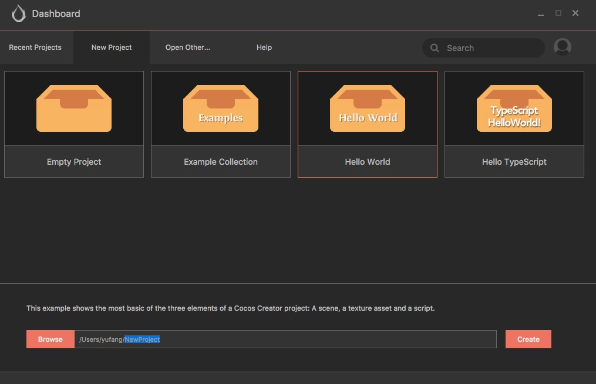
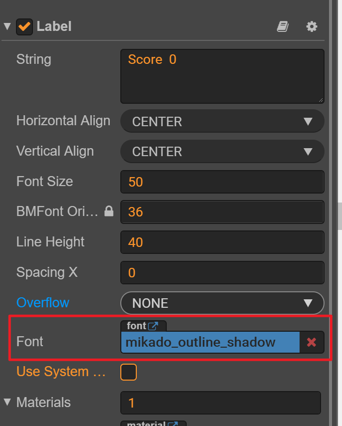
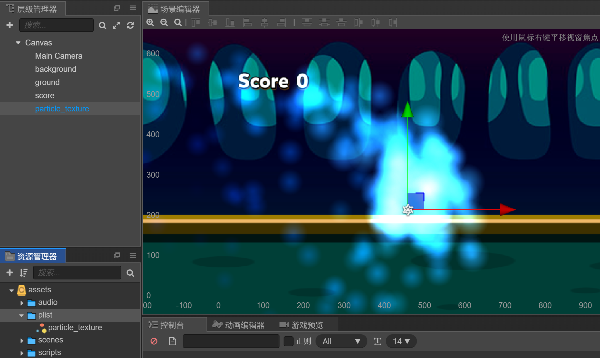
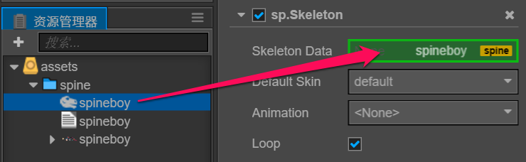

# Cocos Creator 开发

# 1 快速入门

## 1.1 简介

Cocos 引擎 45% 的市场占有率在国内保持领先，全球 18% 的占有率排名次席。 

目前市场份额最大的手机端游戏引擎

Cocos Creator 是以内容创作为核心，实现了脚本化、组件化和数据驱动的游戏开发工具。 具备了易于上手的内容生产工作流，以及功能强大的开发者工具套件，可用于实现游戏逻辑和高性能游戏效果。

- **一体化编辑器：** 包含了一体化、可扩展的编辑器，简化了资源管理、游戏调试和预览、多平台发布等工作。允许设计师深入参与游戏开发流程，在游戏开发周期中进行快速编辑和迭代。支持 Windows 和 Mac 系统。
- **2D 和 3D：** 同时支持 2D 和 3D 游戏开发，具有可满足您各种游戏类型特定需求的功能。并且深度优化了纯 2D 游戏的编辑器使用体验和引擎性能，内建了 Spine、DragonBones、TiledMap、Box2D、Texture Packer 等 2D 开发中间件的支持。
- **开源引擎：**Cocos Creator 的引擎完全开源，并且保留了 Cocos2d-x 高性能、可定制、容易调试、易学习、包体小的优点。
- **跨平台：** Cocos Creator 深度支持各大主流平台，游戏可以快速发布到 Web、iOS、Android、Windows、Mac，以及各个小游戏平台。在 Web 和小游戏平台上提供了纯 JavaScript 开发的引擎运行时，以获得更好的性能和更小的包体。在其它原生平台上则使用 C++ 实现底层框架，提供更高的运行效率。
- **JavaScript：**您可以完全使用 JavaScript 来开发游戏，在真机上进行快速预览、调试，对已发布的游戏进行热更新。同时支持 TypeScript。
- **高效的工作流程：**Cocos Creator 预制件是预配置的游戏对象，可提供高效而灵活的工作流程，让设计师自信地进行创作工作，而无需为犯下耗时的错误担忧。
- **UI：**内置的 UI 系统能够让您快速、直观地创建用户界面。
- **自定义工具：**您可以借助各种您所需工具扩展编辑器功能以匹配团队工作流程。创建或添加自定义的插件或在插件商店中找到所需资源，插件商店中有上百种能够帮助您加快项目进程的范例、工具和插件。


## 1.2 组件化开发

- 传统开发模式 ： 代码 驱动 数据、资源
- 组件开发的好处
  - 先有数据节点
  - 给数据节点添加组件，赋予节点对象不同的功能
  - 组件重用，开发模式比较统一

## 1.3 安装Cocos Creator

官网  https://www.cocos.com/creator 


## 1.4 Hello World 初体验

在 Dashboard 中，打开 **新建项目** 选项卡，选中 `Hello World` 项目模板。



然后在下面的项目路径栏中指定一个新项目存放路径，路径的最后一部分就是项目文件夹名称。

填好路径后点击右下角的 **新建项目** 按钮，就会自动以 Hello World 项目模板创建项目并打开。

## 1.5 编辑器界面介绍


## 1.6 编辑器常用设置

我们可以再编辑器内置的代码编辑器完成代码编写，但是内部编辑器功能并不完善，只适合快速浏览和做少量编辑的需要。对程序员来说，我们需要更成熟完善的代码编辑环境。


## 1.7 项目目录结构解析

初次创建并打开一个 Cocos Creator 项目后，开发者的项目文件夹将会包括以下结构：

```
ProjectName（项目文件夹）
├──assets
├──library
├──local
├──packages
├──settings
├──temp
└──project.json
```

下面我们将会介绍每个文件夹的功能。

**资源文件夹（assets）**

assets 将会用来放置游戏中所有的本地资源、脚本和第三方库文件。只有在 assets 目录下的内容才能显示在 资源管理器 中。assets 中的每个文件在导入项目后都会生成一个相同名字的 .meta 文件，用于存储对应的资源配置和索引信息。.meta 文件需要一并提交到版本控制系统。

一些第三方工具生成的工程或设计原文件，如 TexturePacker 的 `.tps` 文件，或 Photoshop 的 `.psd` 文件，可以选择放在 `assets` 里面来管理。

**资源库（library）**

`library` 是将 `assets` 中的资源导入后生成的，在这里文件的结构和资源的格式将被处理成最终游戏发布时需要的形式。

当 `library` 丢失或损坏的时候，只要删除整个 `library` 文件夹再打开项目，就会重新生成资源库。

**本地设置（local）**

`local` 文件夹中包含该项目的本机上的配置信息，包括编辑器面板布局，窗口大小，位置等信息。开发者不需要关心这里的内容。

**扩展插件文件夹（packages）**

`packages` 文件夹用于放置此项目的自定义扩展插件。如需手动安装扩展插件，可以手动创建此文件夹。如需卸载扩展插件，在 `packages` 中删除对应的文件夹即可。

**项目设置（settings）**

`settings` 里保存项目相关的设置，如 **构建发布** 菜单里的包名、场景和平台选择等。

**临时文件夹（temp）**

`temp` 是临时文件夹，用于缓存一些 Cocos Creator 在本地的临时文件。这个文件夹可以在关闭 Cocos Creator 后手动删除，开发者不需要关心这里面的内容。

**project.json**

`project.json` 文件和 `assets` 文件夹一起，作为验证 Cocos Creator 项目合法性的标志，只有包括了这两个内容的文件夹才能作为 Cocos Creator 项目打开。开发者不需要关心里面的内容。

**构建目标（build）**

在使用主菜单中的 **项目 -> 构建发布...** 使用默认发布路径发布项目后，编辑器会在项目路径下创建 `build`目录，并存放所有目标平台的构建工程。


## 1.8 基本概念

### 1.8.1 场景

 Cocos Creator是由一个一个的游戏场景组成，场景是一个树形结构，场景是由`有各种层级关系的节点`组成； 

**场景编辑器** 是内容创作的核心工作区域，您将使用它选择和摆放场景图像、角色、特效、UI 等各类游戏元素。在这个工作区域里，您可以选中并通过 **变换工具** 修改节点的位置、旋转、缩放、尺寸等属性，并可以获得所见即所得的场景效果预览。 

### 1.8.2 节点和组件

Cocos Creator 的工作流程是以组件式开发为核心的，组件式架构也称作 **组件-实体系统**（或 Entity-Component System），简单的说，就是以组合而非继承的方式进行实体的构建。

在 Cocos Creator 中，**节点（Node）**是承载组件的实体，我们通过将具有各种功能的 **组件（Component）**挂载到节点上，来让节点具有各式各样的表现和功能。接下来我们看看如何在场景中创建节点和添加组件。

每个视觉元素都是一个节点，通常我们不会把所有节点平铺在场景上，而是会按照一定的分类和次序组织成如下图所示的节点树： 


  

### 1.8.3 坐标

 在Cocos Creator中采用的是右手坐标系，向右为X轴正方向，向上为Y轴正方向，延屏幕向外为Z轴正方向。 

  

### 1.8.4 事件响应

1. 触摸事件

   **（1）this.node.on**

   - `TOUCH_START` 当手指触摸到屏幕时。
   - `TOUCH_MOVE` 当手指在屏幕上移动时。
   - `TOUCH_END` 当手指在目标节点区域内离开屏幕时。
   - `TOUCH_CANCEL` 当手指在目标节点区域外离开屏幕时。

   **（2）事件的三个阶段和事件冒泡**

   ​	鼠标或触摸事件会被系统调用 dispatchEvent 方法触发，触发的过程包含三个阶段：

   - 捕获阶段：派发事件给捕获目标（通过 `_getCapturingTargets` 获取），比如，节点树中注册了捕获阶段的父节点，从根节点开始派发直到目标节点。

   - 目标阶段：派发给目标节点的监听器。

   - 冒泡阶段：派发事件给冒泡目标（通过 `_getBubblingTargets` 获取），比如，节点树中注册了冒泡阶段的父节点，从目标节点开始派发直到根节点。
     同时您可以将事件派发到父节点或者通过调用 stopPropagation 拦截它。
     推荐使用这种方式来监听节点上的触摸或鼠标事件，请不要在节点上直接使用 cc.eventManager。
     你也可以注册自定义事件到节点上，并通过 emit 方法触发此类事件，对于这类事件，不会发生捕获冒泡阶段，只会直接派发给注册在该节点上的监听器
     你可以通过在 emit 方法调用时在 type 之后传递额外的参数作为事件回调的参数列表

2. 键盘事件

   **（1）事件类型**

   - ##### 	KEY_DOWN

   	> 当按下按键时触发的事件

   - ##### KEY_UP

   	> 当松开按键时触发的事件

   **（2）事件类型回调方法**

   ```js
   cc.systemEvent.on(cc.SystemEvent.EventType.KEY_DOWN,function (e) {
               cc.log("KEY_DOWN",e.keyCode)
   },this);
   cc.systemEvent.on(cc.SystemEvent.EventType.KEY_UP,function (e) {
       cc.log("KEY_UP",e.keyCode)
        switch (e.keyCode) {
            case cc.macro.KEY.space : {
                cc.log("空格事件")
            }
        }
   },this);
   ```

3. 响应自定义事件

   **（1）监听事件**

   ```js
   // 自定义事件类型
   this.node.on("fire",function (msg) {
       cc.log("自定义事件：","fire",msg)
   },this);
   ```

   **（2） 发射事件**

   两种方式  emit  和 dispatchEvent

   ```js
   // 发射事件 emit 
   // 只能派送给自己
   this.node.emit("fire","开火！");
   
   // 可以做事件传递
   // 参数2--> 表示事件是否向上传递
   let msgForDispatchEvent = new cc.Event.EventCustom("remoteFire",true);
   msgForDispatchEvent.detail = "远程开火！";
   this.node.dispatchEvent(msgForDispatchEvent)
   ```
   
   


# 2 游戏资源管理

从本质上说，每个游戏都是由种类繁多，数量庞大的资源构成的，因此，管理包括图片、声音、字体、粒子、地图等多媒体资源是一款游戏引擎的核心功能。资源管理的知识主要有几个方面：包括对于资源的组织，运行期对于资源的载入、清理及对于资源的操作以及资源的优化。

本节主要介绍图片、音乐音效、预置体、字体、粒子、瓦片地图等资源在Cocos Creator中的管理和使用，将从资源组织，资源操作及资源优化等方面分别介绍资源的管理方式。

## 2.1 图片资源的管理

图片资源又称贴图，是游戏中，尤其是2D游戏中绝大部分对象的渲染源，图片资源一般由制图软件制作而成并输出成游戏引擎支持的格式，目前支持的格式包括JPG和PNG两种，除了单张图片外，Cocos Creator还支持图集资源的导入和自动图集资源的生成功能。

### 2.1.1 图片资源的导入

图片资源导入的方式非常简单，就是将图片资源复制到资源管理器所在的目录下，在资源管理器中的对应目录下就可以看到相对应的图片资源，在对应的资源管理器中会显示自身图片的缩略图，以方便你找到想选的那个图片，单击三角形按钮就可以打开图片的子资源，也就是说单击开三角形以后可以看到同名的SpriteFrame,SpriteFrame是精灵类用来显示图像的对象，对于图片集资源来说，可以有多个图片资源在一个资源名下，直接将SpriteFrame或者图像资源从资源管理器中拖拽到场景编辑器，或者属性监视器的对应属性下时，就可以设置节点的图片显示。单击对应的图片资源文件或者SpriteFrame就可以看到对应的属性检查器中可以编辑的属性，但是目前这些属性的编辑暂时无法影响图片资源在游戏中使用时的属性，应该是为未来引擎的扩展预留的编辑接口：


图片资源导入属性编辑需要注意的是，在Cocos Creator 2.0版本后，WrapMode、FilterMode和PremultiplyAlpha这些参数才开始有效。


### 2.1.2 图集资源的制作和导入

图集（Atlas）也称作 Sprite Sheet，是游戏开发中常见的一种美术资源。图集是通过专门的工具将多张图片合并成一张大图，并通过 **plist** 等格式的文件索引的资源。可供 Cocos Creator 使用的图集资源由 **plist** 和 **png** 文件组成。下面就是一张图集使用的图片文件：


## 为什么要使用图集资源

在游戏中使用多张图片合成的图集作为美术资源，有以下优势：

- 合成图集时会去除每张图片周围的空白区域，加上可以在整体上实施各种优化算法，合成图集后可以大大减少游戏包体和内存占用
- 多个 Sprite 如果渲染的是来自同一张图集的图片时，这些 Sprite 可以使用同一个渲染批次来处理，大大减少 CPU 的运算时间，提高运行效率。

更形象生动的解释可以观看来自 CodeAndWeb 的教学视频 What is a Sprite Sheet（什么是图集），需要使用 VPN 打开视频。

**制作图集资源**

要生成图集，首先您应该准备好一组原始图片：


接下来可以使用专门的软件生成图集，我们推荐的图集制作软件包括：

- [TexturePacker](https://www.codeandweb.com/texturepacker)
- [Zwoptex](https://zwopple.com/zwoptex/)

使用这些软件生成图集时请选择 cocos2d-x 格式的 plist 文件。最终得到的图集文件是同名的 **plist** 和 **png**。


**注意**：

- Zwoptex 暂时不支持最新版 macOS。
- 若没有特殊需求，也可以直接使用 自动图集 功能生成图集。

**导入图集资源**

将上面所示的 **plist** 和 **png** 文件同时拖拽到 **资源管理器** 中，就可以生成可以在编辑器和脚本中使用的图集资源了。

  

## 2.2 声音资源的管理

游戏不止是简单的界面和动画，还需要音乐音效的配合。在很多经典的游戏中，音乐音效不止是配角，还可以起到控制游戏节奏、向玩家提示游戏场景的作用。例如有些过关游戏中，在进入Boss关时，音乐会变化以此来提示玩家本关的不同之处，另外还有一些游戏，就是以音乐节奏来配合出怪的频率节奏等，这样玩家可以完全融入到游戏中。进入智能手机时代后，对音乐音效的支持更好，这更有助于我们开发游戏。

### 2.2.1 WebAudio方式加载音频

在Cocos Creator中加载音频的方式和图片一样，在资源管理器的路径下添加音频文件即可，从属性检查器中可以设置加载模式，目前支持的加载模式有两种，一种是Web Audio方式，一种是Dom Audio方式，默认的是前者，当浏览器不支持第一种的时候才使用第二种方式。在属性检查器页面，可以选择加载方式，如图所示。


通过 Web Audio 方式加载的声音资源，在引擎内是以一个 buffer 的形式缓存的。
这种方式的优点是兼容性好，问题比较少。缺点是占用的内存资源过多。

### 2.2.2 DomAudio方式加载音频

通过生成一个标准的 audio 元素来播放声音资源，缓存的就是这个 audio 元素。

使用标准的 audio 元素播放声音资源的时候，在某些浏览器上可能会遇到一些限制。比如：每次播放必须是用户操作事件内才允许播放（Web Audio 只要求第一次），且只允许播放一个声音资源等。

如果是比较大的音频如背景音乐，建议使用 DOM Audio


## 2.3 预制体的创建和使用

预制体（Prefabs）这个概念是引自Unity引擎的，它是一种可以被重复使用的游戏对象。例如射击游戏中的子弹都来自于同一个子弹模型，当发射子弹时，就创建一个子弹预制体。也就是说，如果创建一个可以重复使用的对象，那么就该用到预制体了。

### 2.3.1 什么是预制体

在一般的游戏开发中，并没有预制体这个概念，它曾经是Unity的专用术语，它可以简单解释成“用于创建大量相同的物件而使用的模板”，也就是说它可以被用于创建重复的对象。虽说它是从Unity才有的概念，但是预制体的设计思想类似设计模式中的原型模式，是用于创建重复的对象，同时又能保证性能。这种类型的设计模式属于创建型模式，它提供了一种创建对象的最佳方式。当直接创建对象的代价比较大时，则采用这种模式。Cocos Creator中的预制体的用法和Unity类似，当制作好了游戏组件，也就是场景中的任意一个对象时，我们可将它制作成一个组件模板，用于批量的套用工作。例如，场景中本质上要重复使用的东西，像敌人、士兵、子弹或者一个砖块完全相同的墙体。这里说本质是因为默认生成的预制体其实和模板是一模一样的，就像是克隆体，但生成的位置、角度和一些属性可以不同

### 2.3.2 预制体的创建和使用

创建预制体的方法非常简单，直接将编辑好的节点从层级管理器中拖到资源管理器就可以了，在资源管理器选中预设体就可以在属性检查器中设置，**单击**预制体资源，可以对预制体做一些简单的加载策略设置。


**双击**预制体资源可以查看预制体详细的属性。


## 2.4 字体资源的管理

在游戏中，文字占有很重要的位置，尤其对于现在卡牌游戏盛行的市场，界面开发占游戏开发很大的篇幅，其中游戏的介绍、游戏中的提示和对话等都需要用到文字，Cocos Creator在文字渲染方面提供了非常灵活的机制，既可以直接使用系统字，也可以自渲染字体。使用Cocos Creator制作游戏可以使用三类字体资源：系统字体，动态字体和位图字体。

### 2.4.1 系统字体

系统字体就是调用游戏运行平台上自带的系统字体渲染文字，不需要使用任何资源，只需要设置“Use System Font”属性。

### 2.4.2 动态字体

目前 Cocos Creator 支持 **TTF** 格式的动态字体。只要将扩展名为 **TTF** 的字体文件拖拽到 **资源管理器** 中，即可完成字体资源的导入。

### 2.4.3 位图字体

* 位图字体的制作

  位图字体由fnt格式的字体文件和一张png图片组成，fnt文件提供了对每一个字符小图的索引，这种格式可以由专门的位图字体制作工具生成，目前主要的制作位图字体的工具包括hiero和bmfont等，具体配置文件的工具下载地址如下。

  1）http://www.n4te.com/hiero/hiero.jnlp（Java平台）

  2）http://slick.cokeandcode.com/demos/hiero.jnlp（Java平台）

  3）http://www.angelcode.com/products/bmfont/（Windows平台）

* 位图字体的导入和使用

  1）位图字体资源由字体文件（.fnt）和字体图片（.png）组成。导入位图字体的时候，需要将两个文件放入到一个目录下

  

  

  2）使用字体文件首先要创建文字渲染对象“Label”。可以在层级管理器或者主菜单的节点子菜单的创建渲染节点选项中选择创建Label对象，在Label组件中可以看到一个“Font”属性



​		

​		将你想使用的字体文件拖入到“Font”属性中就可以使用该字体了，同时场景编辑界面也会刷新以显示相应的字		体，如果选择“Use SystemFont”，则“Font”属性中的文件便会消失，恢复到使用系统字的情况。

## 2.5 粒子资源管理

作为游戏开发者，不得不承认的事实是再优秀的游戏玩法也要用绚丽的游戏画面来吸引玩家眼球。普通动画并不能完全满足我们的要求，或者说如果用普通动画实现足够绚丽的效果需要更高的代价（更占内存等），尤其对于手机游戏来说，这往往是致命的。如何才能使用很少的内存和计算效率就获得绚丽的动画效果呢？粒子系统是个不错的选择。动画粒子系统会发射大量细小的粒子并且非常高效地渲染这些粒子，比渲染单个精灵要高效得多，它可以模拟随机的，栩栩如生的烟雾、闪电、风雨、雪花掉落的效果。

### 2.5.1 粒子系统

粒子系统最早出现于20世纪80年代，主要用于解决由大量按一定规则运动（变化）的微小物质在计算机上的生成和显示问题，是计算机图形学中模拟一些特定的模糊现象的技术，而这些现象用其他传统的渲染技术是难以实现真实感的。粒子系统通常模拟的现象有火、爆炸、烟、水流、火花、落叶、云、雾、雪、尘、流星尾迹或者发光轨迹这样的抽象视觉效果等。通过很多属性来驱动运行，这些属性不止模拟单个粒子的运动，更是影响着整个粒子体系的运行效果，粒子系统是通过所有粒子共同创造的整体效果。需要说明的是，粒子系统虽然在处理大量单独粒子的变化的运动上很有用处，但是一旦涉及需要考虑粒子间相互作用的场合（这时的计算量呈粒子数量的指数级增长），它就会有些力不从心。比如模拟在相互引力作用下的大量星体的运动、大量粒子的相互碰撞等。简而言之就是无论多么易用的技术也有它的瓶颈，我们需要做的就是扬长避短，发挥这个技术的优势。粒子系统可以使游戏元素更加真实并且富有生命感。通过对自然现象的分析，现实中的这些效果是由很多细小的微粒的变化叠加形成的，因此很难用确定的对象来描述大量随机混乱的粒子效果。

###  2.5.2 粒子系统的特点和构成

无论是通过主观地修改属性后观察运行效果来调试粒子系统，还是通过物理学和数学的公式推导来模拟粒子系统的运行效果，粒子系统都是用大量微粒无规则运动产生独特的视觉效果，因此所有物理引擎都涉及如下特点：

1）包含大量物理微粒对象（粒子）。
2）宏观特性：每一个粒子都符合主要的物理规律。
3）微观特性：在符合规律的基础上，每个粒子都有自己的随机性和独特性。
4）过程动态特性：每一个粒子都是动态的，在移动中不断变化，在每个模拟中都是不断自己更新自己的。

这样按照预先的设计不断产生新的粒子，每个粒子不断地随机变化运动，这样叠加的宏观效果就是粒子系统，可以达到栩栩如生的模拟视觉效果。

一个完整的粒子系统要包括粒子本身、粒子发射器和粒子的整体动态效果。首先介绍粒子。每一个粒子就是一个图形对象，可以使用一个色点或是一张图片来充当粒子。每个粒子都有自己的属性，这些属性不仅包括描述粒子本身的无规则运动的属性，同时也包括粒子在宏观整体运动中的属性，这两种属性共同决定了粒子的运动等性质。

粒子系统的发射器对象就是一个粒子系统的整体，如同一个整体的控制器一样，一片云、一团雾、一次闪电、一股烟都是由一个独立的粒子系统来模拟的，粒子和发射器对象描述了一个粒子系统的复杂性的全部属性，还可以根据自己的游戏设计内容，通过增加新的属性来增加整个粒子系统的复杂性，包括闪烁、随机波动等。

粒子系统的动态效果首先控制了粒子的生成，每个粒子在生成的时候被赋予不同的属性，这些属性增加了系统的随机性；另外动态效果还控制粒子系统的整体移动和变化，包括整体的颜色和位置等变化，比如整体需要有波动等效果。由于粒子是由一个原点喷发出来，所以原点附近集中很多粒子，粒子除了方向和速度以外，还有径向和切向的速度。

### 2.5.3 Cocos Creator中的粒子资源

*  粒子系统可通过[Particle Designer](https://www.71squared.com/particledesigner)软件进行制作，也可以通过网页在线制作  http://www.effecthub.com/particle2dx  .
* 导入粒子资源到资源管理器。
* 从 **资源管理器** 里将粒子资源直接拖到 **层级管理器** 或者 **场景编辑器** ，就可以直接使用




## 2.6 Tiled地图集资源管理

在很多游戏中，整个游戏场景中除了主角精灵之外，游戏的地图背景也是一块“重头戏”。在手机游戏的开发中，为了节约内存空间，一般使用图素拼接的方法组成整个地图。也就是说，首先定下图素块（一般为正方形）的大小，然后美术绘制图素块，最后由策划和美术根据不同项目的需求使用地图编辑器将图素拼接成大地图，并将生成的数据文件和图素交给程序处理。

### 2.6.1 Tiled地图编辑器

Cocos Creator支持Tiled地图编辑器生成的地图数据文件，Tiled地图编辑器的下载地址为http://www.mapeditor.org/。Tiled地图编辑器是一个以普遍使用为目标的地图编辑器，它容易使用并且容易在不同的引擎中使用，目前它的最新版本是使用Qt框架进行开发的。之前也有Java的版本，使用二者的目的就是可以使编辑器跨平台，这点在Cocos2D-X的开发中也比较重要，因为Cocos引擎的跨平台特性，可能使用它的人所使用的操作系统各不相同，为了让大家都可以看到地图的效果，编辑器的“跨平台”也是必要的。Tiled地图编辑器的特性如下：

1）使用多种编码形式的地图数据文件使它可以在不同的游戏引擎中通用。
2）支持普通视角和45度两种视角。
3）可以把对象放在精确到像素的位置。
4）支持撤销/重做和复制/粘贴的操作。
5）图素、层次和对象等通用的概念。
6）自动重新载入图素集。
7）可以重置图素的大小和偏移。
8）支持图章刷和填充等高效工具的使用。
9）支持以通用的格式输入输出来打开和存储文件。

* **安装使用Tiled地图编辑器**

  本课件使用的是1.3.1版本 for Windows系统：


- 地图资源文件的导入 (课件资源已经提供做好的瓦片图)

- 地图所需资源有：

  - .tmx 地图数据
  - .png 图集纹理
  - .tsx tileset 数据配置文件（部分 tmx 文件需要）

- 在cocos creator中使用地图资源

  -  第一种方式：从 **资源管理器** 里将地图资源拖动到层级管理器中
  -  第二种方式：从 **资源管理器** 里将地图资源拖动到场景中
  -  第三种方式：从 **资源管理器** 里将地图资源拖动到已创建 TiledMap 组件的 Tmx File 属性中 

  


## 2.7 骨骼动画

骨骼动画资源是由 [Spine](http://zh.esotericsoftware.com/) 所导出的数据格式（Creator v2.0.7 及以下支持 Spine v2.5，Creator v2.0.8～v2.1 支持 Spine v3.6，Creator v2.2 支持 Spine v3.7，Creator v2.3 及以上支持 Spine v3.8）。

### 2.7.1 骨骼动画介绍

**什么是骨骼动画**

传统的动画，一般是对一个物体对象进行位移、旋转、缩放、变形，然后把关键帧的信息记录下来，在播放的时候按照关键帧时间对物体对象进行位移、旋转、缩放、变形，并在关键帧与关键帧之间做插值运算。

骨骼动画的特点是，需要做动画的物体对象本身不记录位移、旋转、缩放、变形信息，而是通过了第三方的“骨骼”物体记录动画信息，然后物体对象本身只记录受到骨骼物体影响的权重。在播放的时候，通过骨骼物体的关键帧和物体对象记录的权重，让动画重现。

**骨骼动画的好处**

相对于传统动画，骨骼动画似乎多了2个记录：骨骼物体和权重。按道理来说，这种骨骼动画的资源容量和运行效率应该不如传统的动画，那为什么还要做骨骼动画呢？

好处有以下几点：

1、骨骼动画是影响到顶点级别的动画，而且可以多根骨骼根据权重影响同一个顶点，不论是2D或者3D使用，都可以让动画做得更丰富。

2、做到了对象和动画分离，我们只需要记录了物体对于骨骼的蒙皮权重，就可以单独的去制作骨骼的动画，在保证蒙皮信息和骨骼信息一致的情况下，还可以多个物体之间共享动画。

3、相对于2D的逐帧动画大大的节省资源容量。

### 2.7.2 导入骨骼动画资源

骨骼动画所需资源有：

- `.json/.skel` 骨骼数据

- `.png` 图集纹理

- `.txt/.atlas` 图集数据

  

### 2.7.3 创建骨骼动画

创建骨骼动画资源有以下三种方式：

1. 从 **资源管理器** 中将骨骼动画资源拖动到 **层级管理器**:

   

2. 从 **资源管理器** 中将骨骼动画资源拖动到 **场景编辑器**:

   

3. 从 **资源管理器** 中将骨骼动画资源拖动到 **属性检查器** Spine 组件的 Skeleton Data 属性中：

   