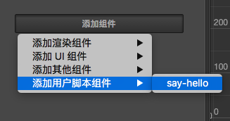
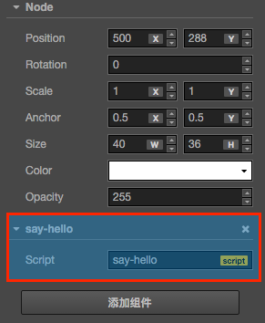
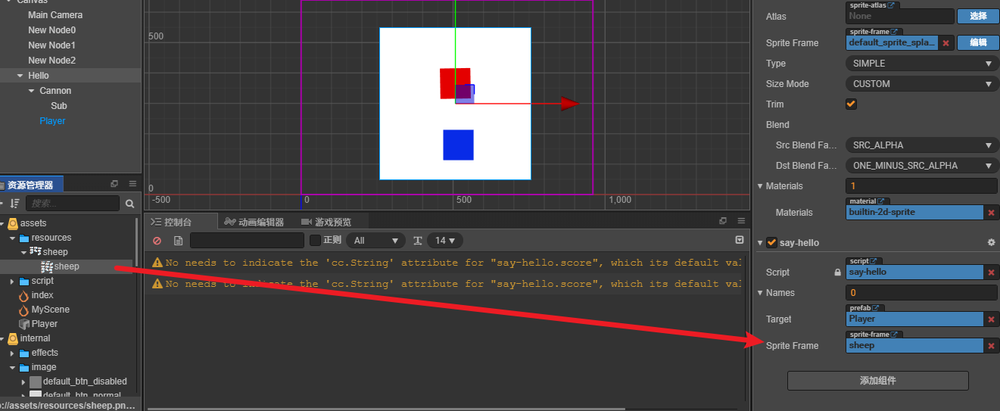
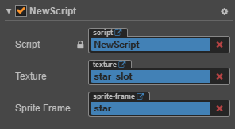

# 脚本编程

Cocos Creator 的脚本主要是通过扩展组件来进行开发的。目前 Cocos Creator 支持 **JavaScript** 和 TypeScript 两种脚本语言。通过编写脚本组件，并将它赋予到场景节点中来驱动场景中的物体。

考虑到大多数学员更熟悉JavaScript，本课程采用JavaScript作为脚本语言。

在组件脚本的编写过程中，你可以通过声明属性，将脚本中需要调节的变量映射到 **属性检查器**（Properties） 中，供策划和美术调整。于此同时，你也可以通过注册特定的回调函数，来帮助你初始化，更新甚至销毁节点。


# 1 节点和组件 

## 1.1 创建和使用脚本组件

* 创建脚本组件

  在 Cocos Creator 中，脚本也是资源的一部分。你可以在资源编辑器中通过点击"创建"按钮来添加并选择 JavaScript 或者 TypeScript 来创建一份组件脚本。此时你会在你的资源编辑器中得到一份新的脚本：

  

  一份简单的组件脚本如下：

  ```javascript
  cc.Class({
      extends: cc.Component,
  
      properties: {
      },
  
      // use this for initialization
      onLoad: function () {
      },
  
      // called every frame, uncomment this function to activate update callback
      update: function (dt) {
      },
  });
  ```

* 使用脚本组件

  将脚本添加到场景节点中，实际上就是为这个节点添加一份组件。我们先将刚刚创建出来的 **NewScript.js**重命名为 **say-hello.js**。然后选中我们希望添加的场景节点，此时该节点的属性会显示在 **属性检查器** 中。在 **属性检查器** 的最下方有一个 **添加组件** 的按钮，点击按钮并选择 **添加用户脚本 -> say-hello** 来添加我们刚刚编写的脚本组件。

  

  如果一切顺利，你将会看到你的脚本显示在 **属性检查器** 中：

  

  **注意**：用户也可以通过直接拖拽脚本资源到 **属性检查器** 的方式来添加脚本。

## 1.2 使用 cc.Class 声明类型

 `cc.Class` 是一个很常用的 API，用于声明 Cocos Creator 中的类，为了方便区分，我们把使用 cc.Class 声明的类叫做 **CCClass**。 

* 定义一个 CCClass

  调用 `cc.Class`，传入一个原型对象，在原型对象中以键值对的形式设定所需的类型参数，就能创建出所需要的类。

  ```javascript
  let Sprite = cc.Class({
      name: "sprite",
  });
  ```

  以上代码用 cc.Class 创建了一个类型，并且赋给了 `Sprite` 变量。同时还将类名设为 "sprite"，类名用于序列化，一般可以省略。

* 实例化

   `Sprite` 变量保存的是一个 JavaScript 构造函数，可以直接 new 出一个对象： 

  ```javascript
  let obj = new Sprite();
  ```

* 判断类型

  需要做类型判断时，可以用 JavaScript 原生的 `instanceof`：

  ```javascript
  cc.log(obj instanceof Sprite);       // true
  ```

* 实例方法

  ```js
  let Sprite = cc.Class({
      // 声明一个名叫 "print" 的实例方法
      print: function () { }
  });
  ```

  

* 继承

  使用 `extends` 实现继承：

  ```js
  // 父类
  let Shape = cc.Class();
  
  // 子类
  let Rect = cc.Class({
      extends: Shape
  });
  ```


## 1.3 声明自定义属性

### 1.3.1 简单声明

 在多数情况下，我们都可以使用简单声明。 

**（1）基本类型**

- 当声明的属性为基本 JavaScript 类型时，可以直接赋予默认值：

  ```javascript
    properties: {
        height: 20,       // number
        type: "actor",    // string
        loaded: false,    // boolean                
        target: null,     // object
    }
  ```

- 当声明的属性具备类型时（如：`cc.Node`，`cc.Vec2` 等），可以在声明处填写他们的构造函数来完成声明，如：

  ```javascript
    properties: {
        target: cc.Node,
        pos: cc.Vec2,
    }
  ```

**（2）数组类型**

 当声明属性是一个数组时，可以在声明处填写他们的类型或构造函数来完成声明，如： 

```js
properties: {
      any: [],      		// 不定义具体类型的数组
      bools: [cc.Boolean],
      strings: [cc.String],
      floats: [cc.Float],
      ints: [cc.Integer],
      values: [cc.Vec2],
      nodes: [cc.Node],
      frames: [cc.SpriteFrame],
}
```


### 1.3.2 完整声明

 有些情况下，我们需要为属性声明添加参数，这些参数控制了属性在 **属性检查器** 中的显示方式，以及属性在场景序列化过程中的行为。 

**（1）基本类型**

```javascript
properties: {
    score: {
        default: 0,
        displayName: "得分",
        tooltip: "设置玩家初始得分",
    }
}
```

以上代码为 `score` 属性设置了三个参数 `default`, `displayName` 和 `tooltip`。这几个参数分别指定了 `score` 的默认值为 0，在 **属性检查器** 里，其属性名将显示为：“Score (player)”，并且当鼠标移到参数上时，显示对应的 Tooltip。

下面是常用参数：

- **default**: 设置属性的默认值，这个默认值仅在组件**第一次**添加到节点上时才会用到
- **type**: 限定属性的数据类型
- **visible**: 设为 false 则不在 **属性检查器** 面板中显示该属性
- **serializable**: 设为 false 则不序列化（保存）该属性
- **displayName**: 在 **属性检查器** 面板中显示成指定名字
- **tooltip**: 在 **属性检查器** 面板中添加属性的 Tooltip

在属性检查器中展示


**（2）数组类型**

数组的 default 必须设置为 `[]`，如果要在 **属性检查器** 中编辑，还需要设置 type 为构造函数，枚举，或者 `cc.Integer`，`cc.Float`，`cc.Boolean` 和 `cc.String`。

```javascript
properties: {
    names: {
        default: [],
        type: [cc.String]   // 用 type 指定数组的每个元素都是字符串类型
    },

    enemies: {
        default: [],
        type: [cc.Node]     // type 同样写成数组，提高代码可读性
    },
}
```


## 1.4 脚本生命周期的回调函数

游戏运行的时期自动执行相关脚本，用户不需要手工调用它们。

目前提供给用户的生命周期回调函数主要有：

- onLoad
- onEnable
- start
- update
- lateUpdate
- onDisable
- onDestroy

### 1.4.1 onLoad

组件脚本的初始化阶段，我们提供了 `onLoad` 回调函数。`onLoad` 回调会在节点首次激活时触发，比如所在的场景被载入，或者所在节点被激活的情况下。在 `onLoad` 阶段，保证了你可以获取到场景中的其他节点，以及节点关联的资源数据。onLoad 总是会在任何 start 方法调用前执行，这能用于安排脚本的初始化顺序。通常我们会在 `onLoad` 阶段去做一些初始化相关的操作。例如：

```js
cc.Class({
  extends: cc.Component,

  properties: {
    bulletSprite: cc.SpriteFrame,
    gun: cc.Node,
  },

  onLoad: function () {
    this._bulletRect = this.bulletSprite.getRect();
    this.gun = cc.find('hand/weapon', this.node);
  },
});
```

### 1.4.2 onEnable

当组件的 `enabled` 属性从 `false` 变为 `true` 时，或者所在节点的 `active` 属性从 `false` 变为 `true`时，会激活 `onEnable` 回调。倘若节点第一次被创建且 `enabled` 为 `true`，则会在 `onLoad` 之后，`start` 之前被调用。

### 1.4.3 start

`start` 回调函数会在组件第一次激活前，也就是第一次执行 `update` 之前触发。`start` 通常用于初始化一些中间状态的数据，这些数据可能在 update 时会发生改变，并且被频繁的 enable 和 disable。

```js
cc.Class({
  extends: cc.Component,

  start: function () {
    this._timer = 0.0;
  },

  update: function (dt) {
    this._timer += dt;
    if ( this._timer >= 10.0 ) {
      console.log('I am done!'); 
      this.enabled = false;
    }
  },
});
```

### 1.4.4 update

游戏开发的一个关键点是在每一帧渲染前更新物体的行为，状态和方位。这些更新操作通常都放在 `update`回调中。

```js
cc.Class({
  extends: cc.Component,

  update: function (dt) {
    this.node.y+=1;
  }
});
```

### 1.4.5 lateUpdate

`update` 会在所有动画更新前执行，但如果我们要在动效（如动画、粒子、物理等）更新之后才进行一些额外操作，或者希望在所有组件的 `update` 都执行完之后才进行其它操作，那就需要用到 `lateUpdate` 回调。

```js
cc.Class({
  extends: cc.Component,

  lateUpdate: function (dt) {
    this.node.rotation += 20;
  }
});
```


### 1.4.6 onDisable

当组件的 `enabled` 属性从 `true` 变为 `false` 时，或者所在节点的 `active` 属性从 `true` 变为 `false`时，会激活 `onDisable` 回调。

### 1.4.7 onDestroy

当组件或者所在节点调用了 `destroy()`，则会调用 `onDestroy` 回调，并在当帧结束时统一回收组件。


## 1.5 访问节点和其他组件

你可以在 **属性检查器** 里修改节点和组件，也能在脚本中动态修改。动态修改的好处是能够在一段时间内连续地修改属性、过渡属性，实现渐变效果。脚本还能够响应玩家输入，能够修改、创建和销毁节点或组件，实现各种各样的游戏逻辑。要实现这些效果，你需要先在脚本中获得你要修改的节点或组件。

我们将介绍如何

- 获得组件所在的节点
- 获得当前节点下的其它组件
- 获得其它节点及其下的组件 (使用属性检查器设置)
- 查找子节点

### 1.5.1 获得组件所在的节点

获得组件所在的节点很简单，只要在组件方法里访问 `this.node` 变量：

```js
start: function () {
    let node = this.node;
    node.x = 100;
}
```

### 1.5.2 获得当前节点下的其它组件

你会经常需要获得同一个节点上的其它组件，这就要用到 `getComponent` 这个 API，它会帮你查找你要的组件。

```js
start: function () {
    let label = this.getComponent(cc.Label);
    let text = this.name + 'started';

    // Change the text in Label Component
    label.string = text;
}
```


### 1.5.3 获得其它节点及其下的组件

仅仅能访问节点自己的组件通常是不够的，脚本通常还需要进行多个节点之间的交互。例如，一门自动瞄准玩家的大炮，就需要不断获取玩家的最新位置。Cocos Creator 提供了一些不同的方法来获得其它节点或组件。

* **使用属性检查器设置节点**

  最直接的方式就是在 **属性检查器** 中设置你需要的对象。以节点为例，这只需要在脚本中声明一个 type 为 `cc.Node` 的属性：

  ```js
  // Cannon.js
  
  cc.Class({
      extends: cc.Component,
      properties: {
          // 声明 player 属性
          player: {
              default: null,
              type: cc.Node
          }
      }
  });
  ```

  这段代码在 `properties` 里面声明了一个 `player` 属性，默认值为 null，并且指定它的对象类型为 `cc.Node`。这就相当于在其它语言里声明了 `public cc.Node player = null;`。脚本编译之后，这个组件在 **属性检查器** 中看起来是这样的：

  

  接着你就可以将层级管理器上的任意一个节点拖到这个 Player 控件：

  

  这样一来它的 player 属性就会被设置成功，你可以直接在脚本里访问 player：

  ```js
  // Cannon.js
  cc.Class({
      extends: cc.Component,
      properties: {
          // 声明 player 属性
          player: {
              default: null,
              type: cc.Node
          }
      },
  
      start: function () {
          cc.log("The player is " + this.player.name);
      },
  
      // ...
  });
  ```
  
* **使用属性检查器设置组件**

  在上面的例子中，如果你将属性的 type 声明为 Player 组件，当你拖动节点 **Player Node** 到 **属性检查器**，player 属性就会被设置为这个节点里面的 Player 组件。这样你就不需要再自己调用 `getComponent` 啦。

  ```js
  // Cannon.js
  
  let Player = require("Player");
  
  cc.Class({
      extends: cc.Component,
      properties: {
          // 声明 player 属性，这次直接是组件类型
          player: {
              default: null,
              type: Player
          }
      },
  
      start: function () {
          let playerComp = this.player;
          player.fire();
      },
  
      // ...
  });
  ```

  你还可以将属性的默认值由 `null` 改为数组 `[]`，这样你就能在 **属性检查器** 中同时设置多个对象。
  不过如果需要在运行时动态获取其它对象，还需要用到下面介绍的查找方法。

### 1.5.4 查找子节点

有时候，游戏场景中会有很多个相同类型的对象，像是炮塔、敌人和特效，它们通常都有一个全局的脚本来统一管理。如果用 **属性检查器** 来一个一个将它们关联到这个脚本上，那工作就会很繁琐。为了更好地统一管理这些对象，我们可以把它们放到一个统一的父物体下，然后通过父物体来获得所有的子物体：

```js
// sya-hello.js

cc.Class({
    extends: cc.Component,

    start: function () {
        let children = this.node.children;
        // ...
    }
});
```

你还可以使用 `getChildByName`：

```js
this.node.getChildByName("Cannon");
```

如果子节点的层次较深，你还可以使用 `cc.find`，`cc.find` 将根据传入的路径进行逐级查找：

```js
cc.find("Cannon/Sub", this.node);
```

### 1.5.5 全局名字查找

当 `cc.find` 只传入第一个参数时，将从场景根节点开始逐级查找：

```js
this.backNode = cc.find("Canvas/Hello/Cannon");
```


## 1.6 常用节点和组件接口

 在通过 访问节点和组件 介绍的方法获取到节点或组件实例后，这篇文章将会介绍通过节点和组件实例可以通过哪些常用接口实现我们需要的种种效果和操作。 

### 1.6.1 激活/关闭节点

节点默认是激活的，我们可以在代码中设置它的激活状态，方法是设置节点的 `active` 属性：

```
this.node.active = false;
```

设置 `active` 属性和在编辑器中切换节点的激活、关闭状态，效果是一样的。当一个节点是关闭状态时，它的所有组件都将被禁用。同时，它所有子节点，以及子节点上的组件也会跟着被禁用。要注意的是，子节点被禁用时，并不会改变它们的 `active` 属性，因此当父节点重新激活的时候它们就会回到原来的状态。

也就是说，`active` 表示的其实是该节点 **自身的** 激活状态，而这个节点 **当前** 是否可被激活则取决于它的父节点。并且如果它不在当前场景中，它也无法被激活。我们可以通过节点上的只读属性 `activeInHierarchy`来判断它当前是否已经激活。

```
this.node.active = true;
```

若节点原先就处于 **可被激活** 状态，修改 `active` 为 true 就会立即触发激活操作：

- 在场景中重新激活该节点和节点下所有 active 为 true 的子节点
- 该节点和所有子节点上的所有组件都会被启用，他们中的 `update` 方法之后每帧会执行
- 这些组件上如果有 `onEnable` 方法，这些方法将被执行

```
this.node.active = false;
```

如该节点原先就已经被激活，修改 `active` 为 false 就会立即触发关闭操作：

- 在场景中隐藏该节点和节点下的所有子节点
- 该节点和所有子节点上的所有组件都将被禁用，也就是不会再执行这些组件中的 `update` 中的代码
- 这些组件上如果有 `onDisable` 方法，这些方法将被执行

### 1.6.2 更改节点的父节点

假设父节点为 `parentNode`，子节点为 `this.node`

您可以：

```js
this.node.parent = parentNode;
```

或

```js
this.node.removeFromParent(false);
parentNode.addChild(this.node);
```

这两种方法是等价的。

注意：

- `removeFromParent` 通常需要传入一个 `false`，否则默认会清空节点上绑定的事件和 action 等。
- 通过 创建和销毁节点 介绍的方法创建出新节点后，要为节点设置一个父节点才能正确完成节点的初始化。

### 1.6.3 索引节点的子节点

`this.node.children` 将返回节点的所有子节点数组。
`this.node.childrenCount` 将返回节点的子节点数量。

**注意** 以上两个 API 都只会返回节点的直接子节点，不会返回子节点的子节点。

### 1.6.4 更改节点的变换（位置、旋转、缩放、尺寸）

**（1）更改节点位置**

分别对 x 轴和 y 轴坐标赋值：

```
this.node.x = 100;
this.node.y = 50;
```

使用 `setPosition` 方法：

```
this.node.setPosition(100, 50);
this.node.setPosition(cc.v2(100, 50));
```

设置 `position` 变量：

```
this.node.position = cc.v2(100, 50);
```

以上两种用法等价。

**（2）更改节点旋转**

```
this.node.rotation = 90;
```

或

```
this.node.setRotation(90);
```

**（3）更改节点缩放**

```
this.node.scaleX = 2;
this.node.scaleY = 2;
```

或

```
this.node.setScale(2);
this.node.setScale(2, 2);
```

以上两种方法等价。`setScale` 传入单个参数时，会同时修改 `scaleX` 和 `scaleY`。

**（4）更改节点尺寸**

```
this.node.setContentSize(100, 100);
this.node.setContentSize(cc.size(100, 100));
```

或

```
this.node.width = 100;
this.node.height = 100;
```

以上两种方式等价。

**（5）更改节点锚点位置**

```
this.node.anchorX = 1;
this.node.anchorY = 0;
```

或

```
this.node.setAnchorPoint(1, 0);
```

注意以上这些修改变换的方法会影响到节点上挂载的渲染组件，比如 Sprite 图片的尺寸、旋转等等。

**（6）颜色和不透明度**

在使用 Sprite, Label 这些基本的渲染组件时，要注意修改颜色和不透明度的操作只能在节点的实例上进行，因为这些渲染组件本身并没有设置颜色和不透明度的接口。

假如我们有一个 Sprite 的实例为 `mySprite`，如果需要设置它的颜色：

```
this.node.color = cc.Color.RED;
```

设置不透明度：

```
this.node.opacity = 128;
```

### 1.6.5 常用组件接口

`cc.Component` 是所有组件的基类，任何组件都包括如下的常见接口（假设我们在该组件的脚本中，以 this 指代本组件）：

- `this.node`：该组件所属的节点实例
- `this.enabled`：是否每帧执行该组件的 `update` 方法，同时也用来控制渲染组件是否显示
- `update(dt)`：作为组件的成员方法，在组件的 `enabled` 属性为 `true` 时，其中的代码会每帧执行
- `onLoad()`：组件所在节点进行初始化时（节点添加到节点树时）执行
- `start()`：会在该组件第一次 `update` 之前执行，通常用于需要在所有组件的 `onLoad` 初始化完毕后执行的逻辑

## 1.7 创建和销毁节点

### 1.7.1 创建新节点

除了通过场景编辑器创建节点外，我们也可以在脚本中动态创建节点。通过 `new cc.Node()` 并将它加入到场景中，可以实现整个创建过程。

以下是一个简单的例子:

```javascript
cc.Class({
  extends: cc.Component,

  properties: {
  },

  start: function () {
      let self = this;
      // 加载资源
      cc.loader.loadRes("sheep",cc.SpriteFrame,function (err,spriteFrame) {
          let node = new cc.Node("sprite");
          let sp = node.addComponent(cc.Sprite);
          sp.spriteFrame = spriteFrame;
          node.parent = self.node;
          node.setContentSize(100,100);
      });
  },
});
```

### 1.7.2 克隆已有节点

有时我们希望动态的克隆场景中的已有节点，我们可以通过 `cc.instantiate` 方法完成。使用方法如下：

```javascript
cc.Class({
  extends: cc.Component,

  properties: {
    target: {
      default: null,
      type: cc.Node,
    },
  },

  start: function () {
    var node = cc.instantiate(this.target);
    node.parent = this.node;
    node.setPosition(0, 0);
  },
});
```

### 1.7.3 创建预制节点

和克隆已有节点相似，你可以设置一个预制（Prefab）并通过 `cc.instantiate` 生成节点。使用方法如下：

```javascript
cc.Class({
  extends: cc.Component,

  properties: {
    target: {
      default: null,
      type: cc.Prefab,
    },
  },

  start: function () {
    var node = cc.instantiate(this.target);
    node.parent = this.node;
    node.setPosition(0, 0);
  },
});
```

### 1.7.4 销毁节点

通过 `node.destroy()` 函数，可以销毁节点。值得一提的是，销毁节点并不会立刻被移除，而是在当前帧逻辑更新结束后，统一执行。当一个节点销毁后，该节点就处于无效状态，可以通过 `cc.isValid` 判断当前节点是否已经被销毁。

使用方法如下：

```javascript
cc.Class({
  extends: cc.Component,

  properties: {
    target: cc.Node,
  },

  start: function () {
    // 5 秒后销毁目标节点
    setTimeout(function () {
      this.node.destroy();
    }.bind(this), 5000);
  },

  update: function (dt) {
    if (cc.isValid(this)) {
      this.target.rotation +=  10.0;
    }
  },
});
```

**destroy 和 removeFromParent 的区别**

调用一个节点的 `removeFromParent` 后，它不一定就能完全从内存中释放，因为有可能由于一些逻辑上的问题，导致程序中仍然引用到了这个对象。因此如果一个节点不再使用了，请直接调用它的 `destroy` 而不是 `removeFromParent`。`destroy` 不但会激活组件上的 `onDestroy`，还会降低内存泄露的几率，同时减轻内存泄露时的后果。

总之，如果一个节点不再使用，`destroy` 就对了，不需要 `removeFromParent` 也不需要设置 `parent` 为 `null` 哈。


# 2 加载和切换场景

在Cocos Creator的脚本中，可以使用导演类的loadScene方法加载场景，loadScene可以传递一个或两个参数，第一个参数是场景名称，第二个参数是场景加载完毕后的回调函数，场景加载完毕后的回调函数可以进行必要的初始化或数据传递操作，代码如下所示。

```js
cc.director.loadScene("MyScene");
```

有些场景的加载时间过长，会造成游戏的卡顿，这时我们可以使用预加载的方式，在时间充裕的时候加载场景数据，将这些数据缓存在内存中，这种方式本质上是一种“空间换时间”的方式。**预加载**的操作代码如下所示。

```js
cc.director.preloadScene("table", function () {
    cc.log("Next scene preloaded");
});
```

**通过常驻节点进行场景资源管理和参数传递**

引擎同时只会运行一个场景，当切换场景时，默认会将场景内所有节点和其他实例销毁。如果我们需要用一个组件控制所有场景的加载，或在场景之间传递参数数据，就需要将该组件所在节点标记为「常驻节点」，使它在场景切换时不被自动销毁，常驻内存。我们使用以下接口：

```
cc.game.addPersistRootNode(myNode);
```

上面的接口会将 `myNode` 变为常驻节点，这样挂在上面的组件都可以在场景之间持续作用，我们可以用这样的方法来储存玩家信息，或下一个场景初始化时需要的各种数据。

如果要取消一个节点的常驻节点：

```
cc.game.removePersistRootNode(myNode);
```


# 3 资源管理 


## 3.1 通过资源属性设置和加载资源

在 Creator 中，所有继承自 `cc.Asset` 的类型都统称资源，如 `cc.Texture2D`, `cc.SpriteFrame`, `cc.AnimationClip`, `cc.Prefab` 等。它们的加载是统一并且自动化的，相互依赖的资源能够被自动预加载。

> 例如，当引擎在加载场景时，会先自动加载场景关联到的资源，这些资源如果再关联其它资源，其它也会被先被加载，等加载全部完成后，场景加载才会结束。

脚本中可以这样定义一个 Asset 属性：

```javascript
// NewScript.js

cc.Class({
    extends: cc.Component,
    properties: {
        sprite_frame: {
            default: null,
            type: cc.SpriteFrame
        },

    }
});
```

## 3.2 如何在属性检查器里设置资源

只要在脚本中定义好类型，就能直接在 **属性检查器** 很方便地设置资源。假设我们创建了这样一个脚本：

```javascript
// NewScript.js

cc.Class({
    extends: cc.Component,
    properties: {
        sprite_frame: {
            default: null,
            type: cc.spriteFrame
        },

    }
});
```

将它添加到节点后，在 **属性检查器** 中是这样的：


接下来我们从 **资源管理器** 里面分别将一张 Texture 和一个 SpriteFrame 拖到 **属性检查器** 的对应属性中：



结果如下：



这样就能在脚本里直接拿到设置好的资源：

```javascript
onLoad: function () {
     let sprite = this.node.getComponent(cc.Sprite);
     sprite.spriteFrame = this.sprite_frame;
}
```

 在 **属性检查器** 里设置资源虽然很直观，但资源只能在场景里预先设好，没办法动态切换。


## 3.3 动态加载资源

Creator 提供了 `cc.loader.loadRes` 这个 API 来专门加载那些位于 resources 目录下的 Asset。调用时，你只要传入相对 resources 的路径即可，并且路径的结尾处 **不能包含文件扩展名**。

```javascript
let self = this;
// 加载 Prefab
cc.loader.loadRes("Player", function (err, prefab) {
    let newNode = cc.instantiate(prefab);
    self.node.addChild(newNode);
});

```

**加载 SpriteFrame**

图片设置为 Sprite 后，将会在 **资源管理器** 中生成一个对应的 SpriteFrame。但如果直接加载 `test assets/image`，得到的类型将会是 cc.Texture2D。你必须指定第二个参数为资源的类型，才能加载到图片生成的 cc.SpriteFrame：

```javascript
// 加载 SpriteFrame
let self = this;
cc.loader.loadRes("sheep", cc.SpriteFrame, function (err, spriteFrame) {
    self.node.getComponent(cc.Sprite).spriteFrame = spriteFrame;
});
```


## 3.4 资源的释放

`loadRes` 加载进来的单个资源如果需要释放，可以调用 `cc.loader.releaseRes`，`releaseRes` 可以传入和 `loadRes` 相同的路径和类型参数。

```javascript
cc.loader.releaseRes("sheep", cc.SpriteFrame);
cc.loader.releaseRes("sheep");
```

此外，你也可以使用 `cc.loader.releaseAsset` 来释放特定的 Asset 实例。

```javascript
cc.loader.releaseAsset(spriteFrame);
```


# 4 使用动作系统

 Cocos Creator 提供的动作系统可以在一定时间内对节点完成位移，缩放，旋转等各种动作。 

Cocos引擎的Action动作类并不是一个在屏幕中显示的对象，动作必须要依托于Node节点类及它的子类的实例才能发挥它的作用，Cocos中的动作不仅包括位置移动等，还包括跳跃、旋转，甚至是对象透明度的变化和颜色的渐变。这些基本动作可以构成各种复杂的动作，也可以通过sequence形成一个完整的动作序列。

## 4.1基本使用API

动作系统的使用方式也很简单，在 `cc.Node` 中支持如下 API：

```js
// 创建一个移动动作
let action = cc.moveTo(2, 100, 100);
// 执行动作
this.node.runAction(action);
// 停止一个动作
this.node.stopAction(action);
// 停止所有动作
this.node.stopAllActions();
```

## 4.2 动作类型

在 Cocos Creator 中支持非常丰富的各种动作，这些动作主要分为几大类：

### 4.2.1 基础动作

基础动作就是实现各种形变，位移动画的动作，比如 `cc.moveTo` 用来移动节点到某个位置；`cc.rotateBy`用来旋转节点一定的角度；`cc.scaleTo` 用来缩放节点。

基础动作中分为时间间隔动作和即时动作，前者是在一定时间间隔内完成的渐变动作，前面提到的都是时间间隔动作，它们全部继承自 cc.ActionInterval。后者则是立即发生的，比如用来调用回调函数的 cc.callFunc；用来隐藏节点的 cc.hide，它们全部继承自 cc.ActionInstant。

### 4.2.2 容器动作

容器动作可以以不同的方式将动作组织起来，下面是几种容器动作的用途：

1. 顺序动作 `cc.sequence` 顺序动作可以让一系列子动作按顺序一个个执行。示例：

   ```js
    // 让节点左右来回移动
    let seq = cc.sequence(cc.moveBy(0.5, 200, 0), cc.moveBy(0.5, -200, 0));
    node.runAction(seq);
   ```

2. 同步动作 `cc.spawn` 同步动作可以同步执行对一系列子动作，子动作的执行结果会叠加起来修改节点的属性。示例：

   ```js
    // 让节点在向上移动的同时缩放
    let spawn = cc.spawn(cc.moveBy(0.5, 0, 50), cc.scaleTo(0.5, 0.8, 1.4));
    node.runAction(spawn);
   ```

3. 重复动作 `cc.repeat` 重复动作用来多次重复一个动作。示例：

   ```js
    // 让节点左右来回移动，并重复5次
    let seq = cc.repeat(
                cc.sequence(
                    cc.moveBy(2, 200, 0),
                    cc.moveBy(2, -200, 0)
                ), 5);
    node.runAction(seq);
   ```

4. 永远重复动作 `cc.repeatForever` 顾名思义，这个动作容器可以让目标动作一直重复，直到手动停止。

   ```js
    // 让节点左右来回移动并一直重复
    let seq = cc.repeatForever(
                cc.sequence(
                    cc.moveBy(2, 200, 0),
                    cc.moveBy(2, -200, 0)
                ));
   ```

5. 速度动作 `cc.speed` 速度动作可以改变目标动作的执行速率，让动作更快或者更慢完成。

   ```js
    // 让目标动作速度加快一倍，相当于原本2秒的动作在1秒内完成
    let action = cc.speed(
                    cc.spawn(
                        cc.moveBy(2, 0, 50),
                        cc.scaleTo(2, 0.8, 1.4)
                    ), 2);
    node.runAction(action);
   ```

从上面的示例中可以看出，不同容器类型是可以复合的，除此之外，我们给容器类型动作提供了更为方便的链式 API，动作对象支持以下三个 API：`repeat`、`repeatForever`、`speed`，这些 API 都会返回动作对象本身，支持继续链式调用。我们来看一个更复杂的动作示例：

```js
// 一个复杂的跳跃动画
this.jumpAction = cc.sequence(
    cc.spawn(
        cc.scaleTo(0.1, 0.8, 1.2),
        cc.moveTo(0.1, 0, 10)
    ),
    cc.spawn(
        cc.scaleTo(0.2, 1, 1),
        cc.moveTo(0.2, 0, 0)
    ),
    cc.delayTime(0.5),
    cc.spawn(
        cc.scaleTo(0.1, 1.2, 0.8),
        cc.moveTo(0.1, 0, -10)
    ),
    cc.spawn(
        cc.scaleTo(0.2, 1, 1),
        cc.moveTo(0.2, 0, 0)
    )
// 以1/2的速度慢放动画，并重复5次
).speed(2).repeat(5);
```

### 4.2.3 动作回调

动作回调可以用以下的方式声明：

```js
let finished = cc.callFunc(this.myMethod, this, opt);
```

`cc.callFunc` 第一个参数是处理回调的方法，即可以使用 CCClass 的成员方法，也可以声明一个匿名函数：

```js
let finished = cc.callFunc(function () {
    //doSomething
}, this, opt);
```

第二个参数指定了处理回调方法的 context（也就是绑定 this），第三个参数是向处理回调方法的传参。您可以这样使用传参：

```js
let finished = cc.callFunc(function(target, score) {
    cc.log("动作回调");
}, this, 100);
```

在声明了回调动作 `finished` 后，您可以配合 `cc.sequence` 来执行一整串动作并触发回调：

```js
let myAction = cc.sequence(cc.moveBy(1, cc.v2(0, 100)), cc.fadeOut(1), finished);
```

在同一个 sequence 里也可以多次插入回调：

```js
let myAction = cc.sequence(cc.moveTo(1, cc.v2(0, 0)), finished1, cc.fadeOut(1), finished2); 
```

注意: 在 cc.callFunc 中不应该停止自身动作，由于动作是不能被立即删除，如果在动作回调中暂停自身动作会引发一系列遍历问题，导致更严重的 bug。