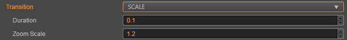
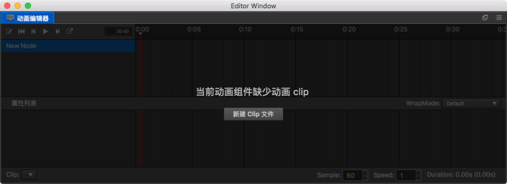

# 1 UI系统

一个完整的游戏一般由不同的系统组成，从技术的角度看一般会包含UI系统、动画系统、物理系统和声音系统等。其中开发声音相关的内容在引擎工具的帮助下变得很简单，在之前资源管理的部分已经介绍。

对于目前市面上的手机游戏来说，特别是2D游戏，除了主要的游戏玩法和战斗以外，主要的工作量都在UI界面的开发上。由于使用率和开发量都比较高，Cocos Creator中的UI组件经过多个版本的迭代后，在易用性和功能完整度上都有较大的提升，本小节就来学习一下Cocos Creator中的UI系统。


## 1.1 基础渲染组件-精灵组件

再复杂的系统都是由基础的简单系统组成的，UI系统也是如此。复杂的UI组件也是由图片和文字等基础元素组成的，接下来就来介绍Cocos Creator中的基础渲染组件 Sprite 精灵组件。

Sprite（精灵）是 2D 游戏中最常见的显示图像的方式，在节点上添加 Sprite 组件，就可以在场景中显示项目资源中的图片。


点击 **属性检查器** 下面的 **添加组件** 按钮，然后从 **渲染组件** 中选择 **Sprite**，即可添加 Sprite 组件到节点上。

### 1.1.1 Sprite 属性

| 属性             | 功能说明                                                     |
| ---------------- | ------------------------------------------------------------ |
| Atlas            | Sprite 显示图片资源所属的 Atlas 图集资源。（Atlas 后面的 选择 按钮，该功能暂时不可用，我们会尽快优化） |
| Sprite Frame     | 渲染 Sprite 使用的 SpriteFrame 图片资源。                    |
| Type             | 渲染模式，包括普通（Simple）、九宫格（Sliced）、平铺（Tiled）、填充（Filled）和网格（Mesh）渲染五种模式 |
| Size Mode        | 指定 Sprite 的尺寸 `Trimmed` 表示会使用原始图片资源裁剪透明像素后的尺寸 `Raw` 表示会使用原始图片未经裁剪的尺寸 `Custom` 表示会使用自定义尺寸。当用户手动修改过 `Size` 属性后，`Size Mode` 会被自动设置为 `Custom`，除非再次指定为前两种尺寸。 |
| Trim             | 勾选后将在渲染时去除原始图像周围的透明像素区域，该项仅在 Type 设置为 Simple 时生效。 |
| Src Blend Factor | 当前图像混合模式                                             |
| Dst Blend Factor | 背景图像混合模式，和上面的属性共同作用，可以将前景和背景 Sprite 用不同的方式混合渲染，效果预览可以参考 glBlendFunc Tool |

添加 Sprite 组件之后，通过从 **资源管理器** 中拖拽 Texture 或 SpriteFrame 类型的资源到 `Sprite Frame` 属性引用中，就可以通过 Sprite 组件显示资源图像。

如果拖拽的 SpriteFrame 资源是包含在一个 Atlas 图集资源中的，那么 Sprite 的 `Atlas` 属性也会被一起设置。

### 1.1.2 渲染模式

Sprite 组件支持五种渲染模式：

- `普通模式（Simple）`：按照原始图片资源样子渲染 Sprite，一般在这个模式下我们不会手动修改节点的尺寸，来保证场景中显示的图像和美术人员生产的图片比例一致。
- `九宫格模式（Sliced）`：图像将被分割成九宫格，并按照一定规则进行缩放以适应可随意设置的尺寸(`size`)。通常用于 UI 元素，或将可以无限放大而不影响图像质量的图片制作成九宫格图来节省游戏资源空间。
- `平铺模式（Tiled）`：当 Sprite 的尺寸增大时，图像不会被拉伸，而是会按照原始图片的大小不断重复，就像平铺瓦片一样将原始图片铺满整个 Sprite 规定的大小。 
- `填充模式（Filled）`：根据原点和填充模式的设置，按照一定的方向和比例绘制原始图片的一部分。经常用于进度条的动态展示。
- `网格模式（Mesh）`：必须使用 **TexturePacker 4.x** 以上版本并且设置 ploygon 算法打包出的 plist 文件才能够使用该模式。

**填充模式（Filled）**

`Type` 属性选择填充模式后，会出现一组新的属性可供配置，让我们依次介绍他们的作用。

| 属性        | 功能说明                                                     |
| ----------- | ------------------------------------------------------------ |
| Fill Type   | 填充类型选择，有 `HORIZONTAL`（横向填充）、`VERTICAL`（纵向填充）和 `RADIAL` （扇形填充）三种。 |
| Fill Start  | 填充起始位置的标准化数值（从 0 ~ 1，表示填充总量的百分比），选择横向填充时，`Fill Start` 设为 0，就会从图像最左边开始填充 |
| Fill Range  | 填充范围的标准化数值（同样从 0 ~ 1），设为 1，就会填充最多整个原始图像的范围。 |
| Fill Center | 填充中心点，只有选择了 `RADIAL` 类型才会出现这个属性。决定了扇形填充时会环绕 Sprite 上的哪个点，所用的坐标系和 [Anchor 锚点](https://docs.cocos.com/creator/manual/zh/content-workflow/transform.html#-anchor-) 是一样的。 |

**Fill Range 填充范围补充说明**

在 `HORIZONTAL` 和 `VERTICAL` 这两种填充类型下，`Fill Start` 设置的数值将影响填充总量，如果 `Fill Start` 设为 0.5，那么即使 `Fill Range` 设为 1.0，实际填充的范围也仍然只有 Sprite 总大小的一半。

而 `RADIAL` 类型中 `Fill Start` 只决定开始填充的方向，`Fill Start` 为 0 时，从 x 轴正方向开始填充。`Fill Range` 决定填充总量，值为 1 时将填充整个圆形。`Fill Range` 为正值时逆时针填充，为负值时顺时针填充。


## 1.2 基础渲染组件-Lable组件

Label组件用来显示一段文字，文字可以是系统字，也可以是图片字或者艺术字体，Label组件将文字排好版并且渲染出来。单击属性检查器下面的添加组件按钮，然后就可以在渲染组件中选择Label，将Label组件添加到节点上，Label的属性编辑界面：


### 1.2.1 Label 属性

| 属性             | 功能说明                                                     |
| ---------------- | ------------------------------------------------------------ |
| String           | 文本内容字符串。                                             |
| Horizontal Align | 文本的水平对齐方式。可选值有 LEFT，CENTER 和 RIGHT。         |
| Vertical Align   | 文本的垂直对齐方式。可选值有 TOP，CENTER 和 BOTTOM。         |
| Font Size        | 文本字体大小。                                               |
| Line Height      | 文本的行高。                                                 |
| Overflow         | 文本的排版方式，目前支持 CLAMP，SHRINK 和 RESIZE_HEIGHT。    |
| Enable Wrap Text | 是否开启文本换行。（在排版方式设为 CLAMP、SHRINK 时生效）    |
| SpacingX         | 文本字符之间的间距。（使用 BMFont 位图字体时生效）           |
| Font             | 指定文本渲染需要的字体文件，如果使用系统字体，则此属性可以为空。 |
| Font Family      | 文字字体名字。在使用系统字体时生效。                         |
| Cache Mode       | 文本缓存类型（v2.0.9 中新增），仅对 系统字体 或 ttf 字体有效，BMFont 字体无需进行这个优化。包括 NONE、BITMAP、CHAR 三种模式。详情见下方的 文本缓存类型。 |
| Use System Font  | 布尔值，是否使用系统字体。                                   |

### 1.2.2 Label 排版

| 属性          | 功能说明                                                     |
| ------------- | ------------------------------------------------------------ |
| CLAMP         | 文字尺寸不会根据 Bounding Box 的大小进行缩放，Wrap Text 关闭的情况下，按照正常文字排列，超出 Bounding Box 的部分将不会显示。Wrap Text 开启的情况下，会试图将本行超出范围的文字换行到下一行。如果纵向空间也不够时，也会隐藏无法完整显示的文字。 |
| SHRINK        | 文字尺寸会根据 Bounding Box 大小进行自动缩放（不会自动放大，最大显示 Font Size 规定的尺寸），Wrap Text 开启时，当宽度不足时会优先将文字换到下一行，如果换行后还无法完整显示，则会将文字进行自动适配 Bounding Box 的大小。如果 Wrap Text 关闭时，则直接按照当前文字进行排版，如果超出边界则会进行自动缩放。**注意**：这个模式在文本刷新的时候可能会占用较多 CPU 资源。 |
| RESIZE_HEIGHT | 文本的 Bounding Box 会根据文字排版进行适配，这个状态下用户无法手动修改文本的高度，文本的高度由内部算法自动计算出来。 |

### 1.2.3 文本缓存类型（Cache Mode）

| 属性   | 功能说明                                                     |
| ------ | ------------------------------------------------------------ |
| NONE   | 默认值，Label 中的整段文本将生成一张位图。                   |
| BITMAP | 选择后，Label 中的整段文本仍将生成一张位图，但是会尽量参与 动态合图。只要满足动态合图的要求，就会和动态合图中的其它 Sprite 或者 Label 合并 Draw Call。由于动态合图会占用更多内存，该模式只能用于文本不常更新的 Label。补充：和 NONE 模式一样，BITMAP 模式会强制给每个 Label 组件生成一张位图，不论文本内容是否等同。如果场景中有大量相同文本的 Label，建议使用 CHAR 模式以复用内存空间。 |
| CHAR   | 原理类似 BMFont，Label 将以“字”为单位将文本缓存到全局共享的位图中，相同字体样式和字号的每个字符将在全局共享一份缓存。能支持文本的频繁修改，对性能和内存最友好。不过目前该模式还存在如下限制，我们将在后续的版本中进行优化： 1、**该模式只能用于字体样式和字号固定（通过记录字体的 fontSize、fontFamily、color、outline 为关键信息，以此进行字符的重复使用，其他有使用特殊自定义文本格式的需要注意），并且不会频繁出现巨量未使用过的字符的 Label**。这是为了节约缓存，因为全局共享的位图尺寸为 2048*2048，只有场景切换时才会清除，一旦位图被占满后新出现的字符将无法渲染。 2、Overflow 不支持 SHRINK。 3、不能参与动态合图（同样启用 CHAR 模式的多个 Label 在渲染顺序不被打断的情况下仍然能合并 Draw Call） |

**注意**：

- Cache Mode 对所有平台都有优化效果。

## 1.3 Button-按钮组件

Button 组件可以响应用户的点击操作，当用户点击 Button 时，Button 自身会有状态变化。另外，Button 还可以让用户在完成点击操作后响应一个自定义的行为。


点击 **属性检查器** 下面的 **添加组件** 按钮，然后从 **UI 组件** 中选择 **Button**，即可添加 Button 组件到节点上。

### 1.3.1 Button 属性

| 属性         | 功能说明                                                     |
| ------------ | ------------------------------------------------------------ |
| Target       | Node 类型，当 Button 发生 Transition 的时候，会相应地修改 Target 节点的 SpriteFrame，颜色或者 Scale。 |
| interactable | 布尔类型，设为 false 时，则 Button 组件进入禁用状态。        |
| Transition   | 枚举类型，包括 NONE、COLOR、SPRITE 和 SCALE。每种类型对应不同的 Transition 设置。详情见下方的 **Button Transition** 部分。 |
| Click Event  | 列表类型，默认为空，用户添加的每一个事件由节点引用、组件名称和一个响应函数组成。详情见下方的 **Button 事件** 部分。 |

**注意**：当 Transition 为 SPRITE 且 disabledSprite 属性有关联一个 spriteFrame 的时候，此时将忽略 Enable Auto Gray Effect 属性

### 1.3.2 Button Transition

Button 的 Transition 用来指定当用户点击 Button 时的状态表现。目前主要有 NONE、COLOR、SPRITE 和 SCALE 四种类型。


* **Color Transition**


| 属性     | 功能说明                          |
| -------- | --------------------------------- |
| Normal   | Button 在 Normal 状态下的颜色。   |
| Pressed  | Button 在 Pressed 状态下的颜色。  |
| Hover    | Button 在 Hover 状态下的颜色。    |
| Disabled | Button 在 Disabled 状态下的颜色。 |
| Duration | Button 状态切换需要的时间间隔。   |

* **Sprite Transition**


| 属性     | 功能说明                                  |
| -------- | ----------------------------------------- |
| Normal   | Button 在 Normal 状态下的 SpriteFrame。   |
| Pressed  | Button 在 Pressed 状态下的 SpriteFrame。  |
| Hover    | Button 在 Hover 状态下的 SpriteFrame。    |
| Disabled | Button 在 Disabled 状态下的 SpriteFrame。 |

* **Scale Transition**



| 属性      | 功能                                                         |
| --------- | ------------------------------------------------------------ |
| Duration  | Button 状态切换需要的时间间隔。                              |
| ZoomScale | 当用户点击按钮后，按钮会缩放到一个值，这个值等于 Button 原始 scale * zoomScale, zoomScale 可以为负数 |

## 1.4 Button 点击事件

Button 可以额外添加 Click 事件，用于响应玩家的点击操作。有以下两种方法。

### 1.4.1 通过属性检查器添加回调


| 序号 | 属性            | 功能说明                                             |
| ---- | --------------- | ---------------------------------------------------- |
| 1    | Target          | 带有脚本组件的节点。                                 |
| 2    | Component       | 脚本组件名称。                                       |
| 3    | Handler         | 指定一个回调函数，当用户点击 Button 时会触发此函数。 |
| 4    | CustomEventData | 用户指定任意的字符串作为事件回调的最后一个参数传入。 |

```js
cc.Class({
    extends: cc.Component,

    properties: {

    },
    
    start () {

    },

    btnClick(event,customEventData) {
        let node = event.target;
        cc.log("通过属性检查器设置点击事件：",customEventData);
    }

});
```

### 1.4.2 通过脚本添加回调

通过脚本添加回调：

2. 通过 `button.node.on('click', ...)` 的方式来添加，这是一种非常简便的方式，但是该方式有一定的局限性，在事件回调里面无法 获得当前点击按钮的屏幕坐标点。

   ```js
    // 假设我们在一个组件的 onLoad 方法里面添加事件处理回调，在 callback 函数中进行事件处理:
   
    cc.Class({
        extends: cc.Component,
   
        properties: {
            button: cc.Button
        },
   
        onLoad: function () {
            this.button.node.on('click', this.callback, this);
        },
   
        callback: function (button) {
            // do whatever you want with button
            // 另外，注意这种方式注册的事件，也无法传递 customEventData
        }
    });
   ```


# 2 动画系统

 Cocos Creator 的动画系统，除了标准的位移、旋转、缩放动画和序列帧动画以外，这套动画系统还支持任意组件属性和用户自定义属性的驱动，再加上可任意编辑的时间曲线和创新的移动轨迹编辑功能，能够让内容生产人员不写一行代码就制作出细腻的各种动态效果。


**注意**：Cocos Creator 自带的动画编辑器适用于制作一些不太复杂的、需要与逻辑进行联动的动画，例如 UI 动画。如果要制作复杂的特效、角色动画、嵌套动画，可以考虑改用 Spine 或者 DragonBones 进行制作。


## 2.1 关于 Animation

在早期的游戏开发中，游戏工程师和设计师们使用简单的技巧开发动画，早期动画的动感由连续快速显示一连串静止的图片产生，这些静止的图片被称为帧，这种动画被称为帧动画。随着设备硬件技术的改进和开发工具的不断完善，更多的高级动画技巧和骨骼动画得到了使用，CocosCreator包含简单的动画编辑系统，可以通过编辑器制作简单的动画。

### 2.1.1 Animation 组件

之前我们了解了 Cocos Creator 是组件式的结构。那么 Animation 也不例外，它也是节点上的一个组件。

### 2.1.2 Clip 动画剪辑

动画剪辑就是一份动画的声明数据,是一种资源类型，我们将它挂载到 Animation 组件上，就能够将这份动画数据应用到节点上。

### 2.1.3 节点数据的索引方式

数据中索引节点的方式是以挂载 Animation 组件的节点为根节点的相对路径。 所以在同个父节点下的同名节点，只能够产生一份动画数据，并且只能应用到第一个同名节点上。

### 2.1.4 clip 文件的参数

**sample**： 定义当前动画数据每秒的帧率，默认为 60，这个参数会影响时间轴上每两个整数秒刻度之间的帧数量（也就是两秒之内有多少格）。

**speed**： 当前动画的播放速度，默认为 1

**duration**： 当动画播放速度为 1 的时候，动画的持续时间

**real time**： 动画从开始播放到结束，真正持续的时间

**wrap mode**： 循环模式

### 2.1.5 动画编辑模式

动画在普通模式下是不允许编辑的，只有在动画编辑模式下，才能够编辑动画文件。但是在编辑模式下，无法对节点进行 增加 / 删除 / 改名 操作。

打开编辑模式：

- 选中一个包含 Animation 组件，并且包含有一个以上 clip 文件的节点。然后在动画编辑器左上角点击唯一的按钮。

退出编辑模式：

- 点击动画编辑器上点击左上角的编辑按钮，或者在场景编辑器左上角的关闭按钮

### 2.1.6 熟悉动画编辑器

动画编辑器一共可以划分为 6 个主要部分。


1. 常用按钮区域，这里负责显示一些常用功能按钮，从左到右依次为：开关编辑状态、返回第一帧、上一帧、播放/暂停、下一帧、新建动画剪辑、插入动画事件
2. 时间轴与事件，这里主要是显示时间轴，添加的自定义事件也会在这里显示。
3. 层级管理（节点树），当前动画剪辑可以影响到的节点数据。
4. 节点内关键帧的预览区域，这里主要是显示各个节点上的所有帧的预览时间轴。
5. 属性列表，显示当前选中的节点在选中的动画剪辑中已经包含了的属性列表。
6. 关键帧，每个属性相对应的帧都会显示在这里

**时间轴的刻度单位表示方式**

时间轴上刻度的表示法是 `01-05`。该数值由两部分组成，冒号前面的是表示当前秒数，冒号后面的表示在当前这一秒里的第几帧。

`01-05` 表示该刻度在时间轴上位于从动画开始经过了 1 秒又 5 帧 的时间。

因为帧率（sample）可以随时调整，因此同一个刻度表示的时间点也会随着帧率变化而有所不同。

- 当帧率为 30 时，`01-05` 表示动画开始后 1 + 5/30 = 1.1667 秒。
- 当帧率为 10 时，`01-05` 表示动画开始后 1 + 5/10 = 1.5 秒。

虽然当前刻度表示的时间点会随着帧率变化，但一旦在一个位置添加了关键帧，该关键帧所在的总帧数是不会改变的， 假如我们在帧率 30 时向 `01-05` 刻度上添加了关键帧，该关键帧位于动画开始后总第 35 帧。之后把帧率修改为 10，该关键帧仍然处在动画开始后第 35 帧，而此时关键帧所在位置的刻度读数为 `03-05`。换算成时间以后正好是之前的 3 倍。

## 2.2 基本操作

### 2.2.1 更改时间轴缩放比例

在操作中如果觉得动画编辑器显示的范围太小，需要按比例缩小，让更多的关键帧显示到编辑器内怎么办？

- 在图中2、4、6区域内滚动鼠标滚轮，可以放大，或者缩小时间轴的显示比例。

### 2.2.3 移动显示区域

如果想看动画编辑器右侧超出编辑器被隐藏的关键帧或是左侧被隐藏的关键帧，这时候就需要移动显示区域：

- 在图中2、4、6区域内按下鼠标中键/右键拖拽。

### 2.2.4 更改当前选中的时间轴节点

- 在时间轴（图 2 区域）区域内点击任意位置或者拖拽，都可以更改当前的时间节点。
- 在图 4 区域内拖拽标示的红线即可。

### 2.2.5 播放/暂停动画

- 在图 1 区域内点击播放按钮，按钮会自动变更为暂停，再次点击则是暂停。
- 播放状态下，保存场景等操作会终止播放。

### 2.2.6 修改 clip 属性

- 在插件底部，修改对应的属性，在输入框失去焦点的时候就会更新到实际的 clip 数据中。

## 2.3 快捷键

- left：向前移动一帧，如果已经在第 0 帧，则忽略当前操作
- right：向后移动一帧
- delete：删除当前所选中的关键帧
- ctrl / cmd + left：跳转到第 0 帧
- ctrl / cmd + right：跳转到有效的最后一帧


## 2.4 创建与挂载动画剪辑

现在我们的节点上已经有了 Animation 组件了，但是还没有相应的动画剪辑数据，动画剪辑也有两种创建方式：

- 在资源管理器中点击左上方的`+`，或者右键空白区域，选择 Animation Clip，这时候会在管理器中创建一个名为 'New AnimationClip' 的剪辑文件。 单单创建还是不够的，我们再次在层级管理器中点选刚刚的节点，在属性检查器中找到 Animation，这时候的 Clips 显示的是 0，我们将它改成 1。 然后将刚刚在资源管理器中创建的 'New AnimationClip' ，拖入刚刚出现的 `animation-clip选择框` 内。
- 如果 Animation 组件中还没有添加动画剪辑文件，则可以在动画编辑器中直接点击 `新建 AnimationClip` 按钮，根据弹出的窗口创建一个新的动画剪辑文件。 需要注意的是，如果选择覆盖已有的剪辑文件，被覆盖的文件内容会被清空。



至此我们已经完成了动画制作之前的准备工作，下一步就是要创建动画曲线了。

## 2.5 剪辑内的数据

一个动画剪辑内可能包含了多个节点，每个节点上挂在多个动画属性，每个属性内的数据才是实际的关键帧。

### 2.5.1 节点数据

动画剪辑通过节点的名字定义数据的位置，本身忽略了根节点，其余的子节点通过与根节点的**相对路径**索引找到对应的数据。 有时候我们会在制作完成动画后，将节点重命名，这样会造成动画数据所以出现问题，如下图：


这时候我们要手动指定数据对应的节点，可以将鼠标移入节点，点击节点右侧出现的更多按钮，并选择 “移动数据”。 要注意的是，根节点名字是被忽略的，所以根节点名字是固定的，并不能修改，并且一直显示在页面左侧。 如上图，New Node/test 节点没有数据，我想将 /New Node/efx_flare 上的数据移到这里：

1. 鼠标移到丢失的节点 - /New Node/efx_flare 上
2. 点击右侧出现的按钮
3. 选择移动数据
4. 将路径改为 /New Node/test，并回车

## 2.6 制作一个完整的动画

### 2.6.1 让牛儿跑起来

用动画编辑器的方式做一个牛儿奔跑的动画


1. 需要在动画编辑器里面添加属性 cc.Sprite.spriteFrame
2. 将三张图片拖拽到关键帧区域
3. 调整关键帧在时间轴中的位置，让动作更顺畅


### 2.6.2 编写脚本使用动作系统

需要使用动作系统让牛儿移动起来

```js
cc.Class({
    extends: cc.Component,

    properties: {
    },

    start () {
        // 创建一个移动动作
        let action = cc.moveBy(5, -1200,0);
        // 执行动作
        this.node.runAction(action);

    },

});
```


让牛儿一直循环的移动

```js
  start () {
        // 创建一个移动动作
        let action = cc.moveBy(5, -1200,0);
        // 设置回调，回到起始位置
        let finish = cc.callFunc(function () {
            this.node.x = 600;
        },this);
        // 顺序动作
        let sequence = cc.sequence(action,finish);
        // 循环动作
        let actionInterval = cc.repeatForever(sequence);
        // 执行循环动作
        this.node.runAction(actionInterval);

    },
```