# 1 游戏成品演示

套牛是一款很有趣的敏捷*小游戏* ，玩法简单有趣，非常适合微信小游戏平台。

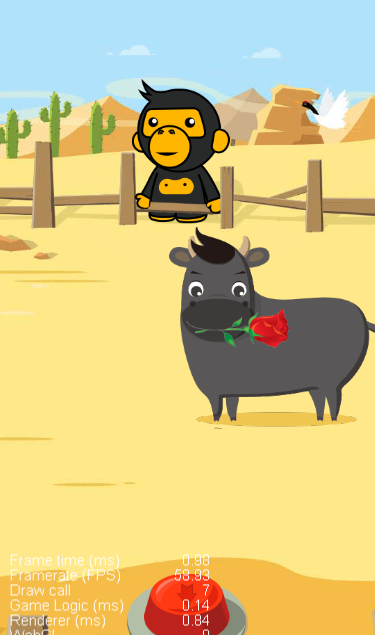

主要操作就是触发套绳按钮，当牛儿不停的奔跑过来的时候，在合适的时机按下套牛按钮就可以捕捉到牛儿。


# 2 开发思路剖析

主要有几个技术点需要考虑：

1. 主场景的搭建需要用到我们的UI系统，比如Sprite,Button。
2. 如何让牛儿奔跑起来，可以用动作系统也可以用动画编辑器，那我们本案例主要采用动作系统配合动画编辑来使用，让大家能同时练习下动作系统&动画编辑器。
3. 套绳动作，触发套绳动作后如何判断绳子正好触碰到牛儿的头部。
4. 定时器开发，因为游戏总需要个结果，不能让玩家一直无止境玩下去，游戏需要个结束点，我们就可以设置限时操作，比如1分钟内结束游戏，然后计算玩家在一分钟内套取得牛儿数量作为游戏结果。


# 3 主界面UI搭建

## 3.1 主要元素

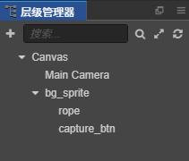

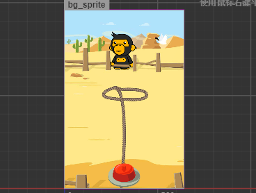


* 背景图片我们用Sprite精灵组件渲染
* 绳子（Sprite）
* 捕捉按钮Button

## 3.2 提供的资源

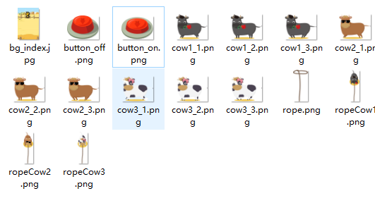

包括背景图片和按钮两种状态，以及套绳等图片。

## 3.3 开始搭建场景

1. 首先要在资源管理器中新建3个文件夹用来保存对应的资源 scenes，scripts，res

   分别用来保存场景、脚本资源和图片等资源

2. 调整尺寸为竖屏640*960，ctrl+s 保存主场景

3. 按顺序搭建，背景 --> 按钮 --> 牛儿 ....


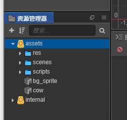


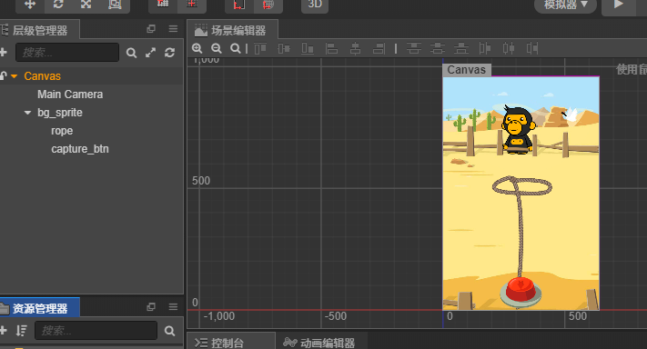

# 4 奔跑的牛

## 4.1 动画实现步骤分析

1. **如何让牛儿跑动起来？**

   让牛儿跑起来只需要用帧动画就可以完成，但是还需要每完成一个回合就切换一种牛的类型。

2. **牛除了跑起来还要让他移动**

   移动可以使用动画编辑器来实现一个位移动画。

## 4.2 代码实现

### 4.2.1 定义一个数组实现奔跑动画

1. 每一个牛有三张皮肤，可以通过循环轮换皮肤来实现牛儿奔跑的效果，首先需要用cc.class帮我们定义一个数组

```js
// 用cc.class 生成一个对象，包含数组皮肤
const cow_skin = cc.Class({
    name:"cow_skin",
    properties:{
        cows:{
            default:[],
            type:[cc.SpriteFrame]
        }
    }
})
```

2. 牛的类型数组

```js
properties: {
    cow_sets: {
    default: [],
    type: [cow_skin]
    }
},
```

3. update回调函数实现帧动画，更换皮肤

```js
update (dt) {
    this.intervalTime += dt;
    // 每隔0.2秒更换皮肤
    let index  = Math.floor(this.intervalTime / 0.2);
    // 获取精灵组件
    let sprite = this.node.getComponent(cc.Sprite);
    // let spriteFrame = sprite.spriteFrame;
    // 获取牛的类型
    let cowSet = this.cow_sets[this.type];
    // 如果最后一个 重置index
    if (index > cowSet.cows.length -1) {
        index = 0;
        // 重置计时参数
        this.intervalTime = 0;
    }
    // 设置皮肤
    sprite.spriteFrame = cowSet.cows[index]
}
```


### 4.2.2 属性检查器按顺序拖入图片

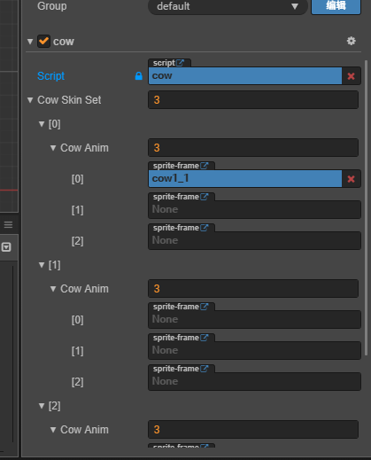


### 4.2.3 将整个cow节点作为预制体

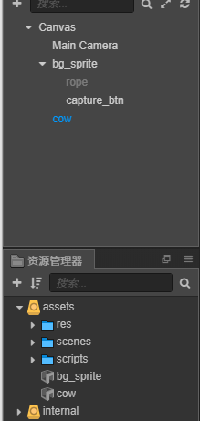

### 4.2.4 动画效果演示

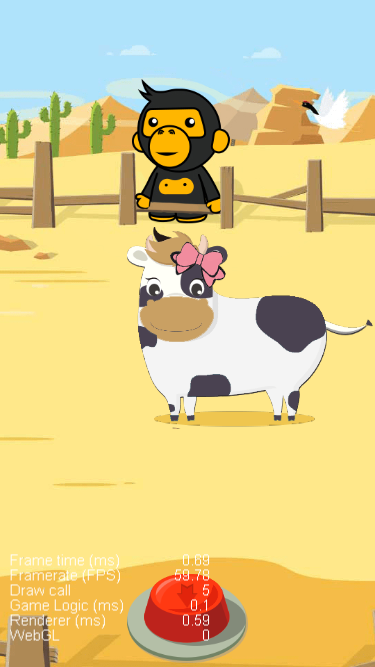


# 5 套绳动作结果判定

## 5.1 套绳逻辑代码

```js
 /**
     * 捕获按钮点击点击
     * @param event
     * @param customEventData
     */
    clickCapture: function (event, customEventData) {
        // 激活当前节点
        this.rope_node.active = true
        // siblingIndex是设置节点在父节点中的排序
        this.rope_node.setSiblingIndex(100);
        // 设置当前位置
        this.rope_node.y = -480;
        // 开始动作
        const up = cc.moveTo(0.5,this.rope_node.x,0);
        // 捕捉结果判定
        let result = cc.callFunc(function () {

            const cow_currentX = this.cow_ins.x;

            if (cow_currentX > -50 & cow_currentX < 50) {
                console.log("捕捉成功")
                this.node.removeChild(this.cow_ins)
                // 更换绳子
                let ropeType = this.cow_ins.getComponent("cow").type+1;
                this.rope_node.getComponent(cc.Sprite).spriteFrame = this.row_imgs[ropeType];
                // 生成新的牛
                this.cow_ins = cc.instantiate(this.cow_prefab);
                this.node.addChild(this.cow_ins)
            }
        },this);
        const down = cc.moveTo(0.5,this.rope_node.x,-600);
        let finish = cc.callFunc(function () {
            // 换绳子
            this.rope_node.getComponent(cc.Sprite).spriteFrame = this.row_imgs[0]
        },this);

        let capture_action = cc.sequence(up,result,down,finish);
        this.rope_node.runAction(capture_action)
    }
```

## 5.2 计分器开发

### 5.2.1 第一步：加上分数显示

1. 创建一个label来显示得分

   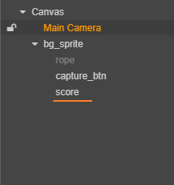


### 5.2.2 第二步：用位图字体让显示更美观

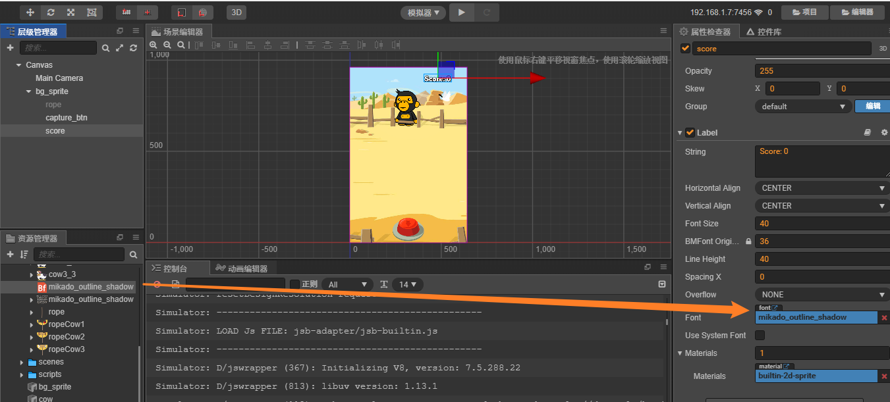

### 5.2.3 第三步：编写逻辑代码

```js
onLoad () {
        // 定义初始化得分为0
        this.scoreNum = 0;
},
    
// 捕捉成功，分数+1
this.scoreNum++;
let scoreLabel = cc.find("Canvas/bg_sprite/score").getComponent(cc.Label);
scoreLabel.string = "Score: " + this.scoreNum;
```

# 6 游戏定时器开发

游戏不能无止境的进行下去，这样会让玩家疲劳且没有成就感，所以我们要加上一个成就系统。

在这个小游戏中我们采用计时制，让玩家在指定的时间内完成游戏。那我们下面首先就需要开发一个计时器功能，比如指定玩家在60s时间内完成游戏，并计算玩家在这段时间内的得分。

## 6.1 需要开发一个定时器并显示到界面

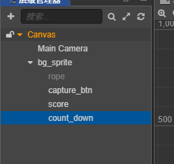

并添加位图字体样式和字体颜色#EB78E6

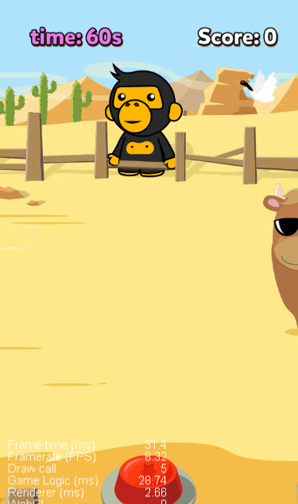

## 6.2 倒计时功能

```js
start () {
    // 获得计时器组件
    let countDownLabel = cc.find("Canvas/bg_sprite/count_down").getComponent(cc.Label);
    let time = 60;
    // 倒计时
    this.schedule(function () {
        time--;
        countDownLabel.string = "Time: " + time + " s";
    },1);
},
```


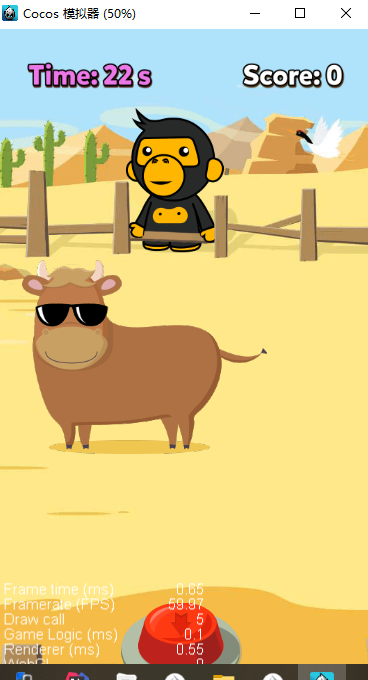


## 6.3 最终成就系统

倒计时为0时游戏结束，并根据玩家的最终得分显示成就；比如小于等于3分就是套牛青铜，大于三分小于6分就是套牛高手，大于6分以上就是套牛王者。

### 6.3.1 制作一个显示用的弹窗

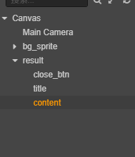

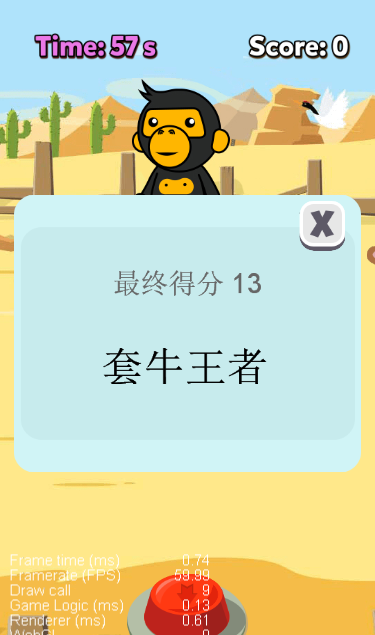

包含一个关闭按钮，标题和称号。

### 6.3.2 游戏结束，展示结果弹窗

1. 代码逻辑

```js
start () {

        this.cow_ins = cc.instantiate(this.cow_prefab);
        this.node.addChild(this.cow_ins);

        // 获得计时器组件
        let countDownLabel = cc.find("Canvas/bg_sprite/count_down").getComponent(cc.Label);
        let time = 60;
        // 倒计时
        this.schedule(function () {
            time--;
            countDownLabel.string = "Time: " + time + " s";
            if (time == 0) {
                // 获取结果弹窗节点
                let resultNode = cc.find("Canvas/result");
                // 通过getChildByName获得子节点， title 和 content
                let titleNode = resultNode.getChildByName("title");
                let contentNode = resultNode.getChildByName("content");
                // 最终得分显示
                titleNode.getComponent(cc.Label).string ="最终得分 "+this.scoreNum ;
                // 最终成就
                let contentLabel = contentNode.getComponent(cc.Label);
                switch (true) {
                    case this.scoreNum <= 3:
                        contentLabel.string = "套牛青铜";
                        break;
                    case this.scoreNum < 6:
                        contentLabel.string = "套牛高手";
                        break;
                    case this.scoreNum >=6:
                        contentLabel.string = "套牛王者";
                        break;
                }
                resultNode.active = true;
                // 暂停游戏
                cc.director.pause();
            }

        },1);
    },
```


2. 最终成功展示

   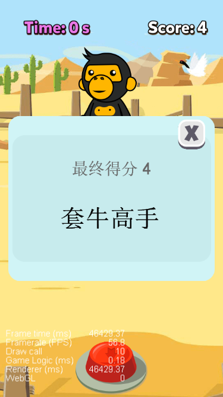

### 6.3.3 关闭按钮

```js
closeBtn() {
    	// 游戏继续
        cc.director.resume();
    	// 重新加载整个场景
        cc.director.loadScene("game");
}

```

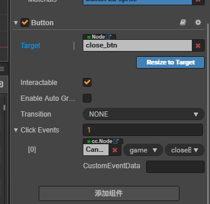