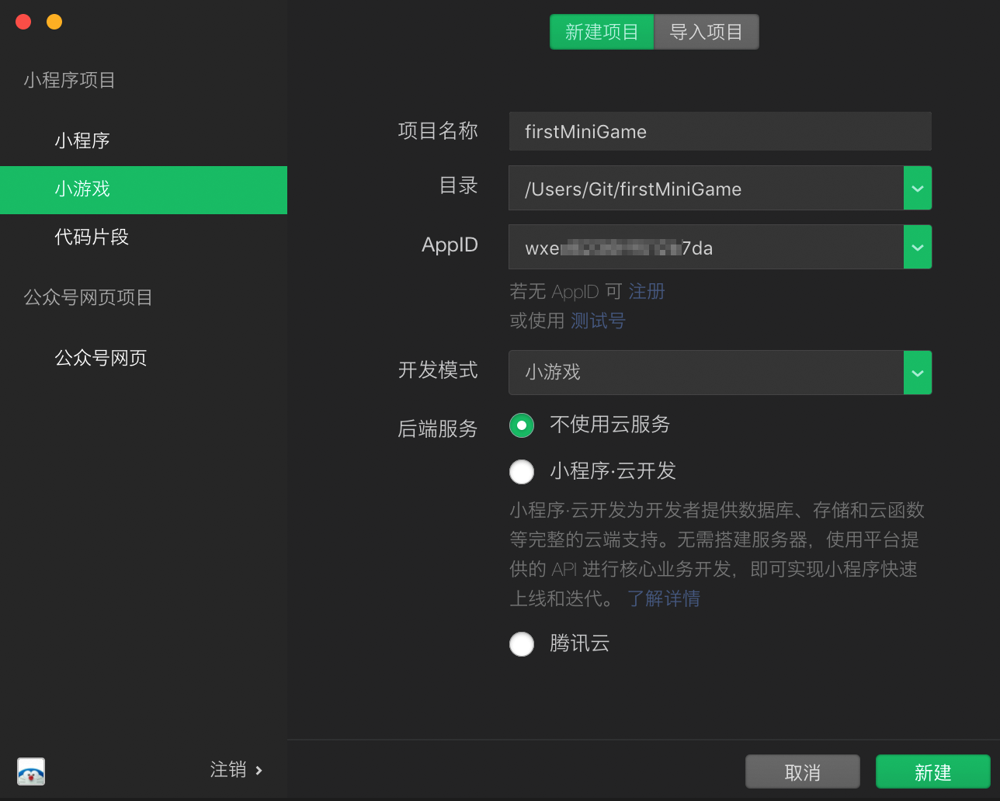

# 1 微信小游戏账号注册

## 1.1 注册小程序


### 1.1.1 注册流程

  


### 1.1.2 注册微信公众平台账号

选择小游戏类型 

微信公众平台官网：https://mp.weixin.qq.com/ 

点击【立即注册】按钮


选择小程序类型


按步骤完善信息即可


### 1.1.3 激活注册邮箱

注册成功后，会收到腾讯发给注册邮箱的一封激活确认邮件


需要准备一个邮箱、一个手机号、实名绑定微信 

### 1.1.4 设置服务类目

登录公众平台->设置->服务类目->游戏->休闲游戏


# 2 安装微信开发者工具

### 2.1 安装并启动开发者工具

注册小游戏帐号后，应下载 [开发者工具](https://developers.weixin.qq.com/miniprogram/dev/devtools/download.html) 并安装到计算机中。


打开已安装的开发者工具客户端，使用刚刚注册小游戏帐号登记的微信帐号“扫一扫”扫码即可进入小游戏开发环境。


选择左侧“小程序项目”中的“小游戏 Tab”，然后点击右侧“+”号，开始创建小游戏项目。



填写合适的项目名称，选择合适的本机空目录后，[登录](https://mp.weixin.qq.com/) 刚刚注册的小程序管理平台，如下图找到小程序的 AppID，填入表单的“AppId”文本框中。


# 3 发布到微信平台

## 3.1 项目-构建发布-微信小游戏


如果出现不能打开微信开发者工具，需要到微信开发者工具里面去设置。


## 3.2 微信开发者工具常用介绍


常用按钮包含

### 3.2.1 编译

点击工具栏中的编译按钮或者使用快捷键 Ctrl(⌘) + B，可以编译当前代码，并自动刷新模拟器。

同时为了帮助开发者调试从不同场景值进入具体的页面，开发者可以添加或选择已有的自定义编译条件进行编译和代码预览（如图）。

**注：编译条件跟项目相关，每个项目可以保存自己相关的编译条件**


### 3.2.2 编译异常信息

在预览或上传的过程中，可能会出现编译异常信息。


忽略上传的文件：在项目文件夹下，某些文件可能不是小程序运行所需的，例如 readme 文档、`.gitignore` 文件等。为了优化大小，在预览和上传的过程中，这些文件将不会被打包。

体积过大的文件：如果勾选了 ES6 转 ES5 或代码压缩的选项，为了优化编译速度，对于某些体积很大的 JS 文件，工具会跳过对这些文件的处理。

### 3.2.3 预览


### 3.2.4 真机调试

要发起一个真机远程调试流程，需要先点击开发者工具的工具栏上 “真机调试” 按钮。


此时，工具会将本地代码进行处理打包并上传，就绪之后，使用手机客户端扫描二维码即可弹出调试窗口，开始远程调试。

### 3.2.5 切后台

 工具栏中前后台切换帮助开发者模拟一些客户端的环境操作。例如当用户从小程序中回到聊天窗口，会触发一个小程序被设置为后台的回调 

### 3.2.6 清缓存


### 3.2.7 上传


上传完之后需要进入微信公众平台，在开发版本里面会看见自己刚刚提交的版本，点击提交之后会进入微信后台审核，由微信官方人员决定是否允许上线。


# 4 微信开放能力

## 4.1 获取用户信息

### 4.1.1 显示按钮的方式

```js
const button = wx.createUserInfoButton({
  type: 'text',
  text: '获取用户信息',
  style: {
    left: 10,
    top: 76,
    width: 200,
    height: 40,
    lineHeight: 40,
    backgroundColor: '#ff0000',
    color: '#ffffff',
    textAlign: 'center',
    fontSize: 16,
    borderRadius: 4
  }
})
button.onTap((res) => {
  // 此处可以获取到用户信息
  console.log(res);
})
```

### 4.1.2 隐式按钮的方式

设置完全透明的方式

```js
let sysInfo = wx.getSystemInfoSync();
//获取微信界面大小
let width = sysInfo.screenWidth;
let height = sysInfo.screenHeight;

let button = window.wx.createUserInfoButton({
    type: 'text',
    text: '',
    style: {
        left: 0,
        top: 0,
        width: width,
        height: height,
        backgroundColor: '#00000000',//最后两位为透明度
        color: '#ffffff',
        fontSize: 20,
        textAlign: "center",
        lineHeight: height,
    }
});
```

在主界面显示用户头像和昵称（如何加载网络头像）

```js
// 获取微信用户信息
let userInfo = res.userInfo;
// 获取头像组件
let icon = cc.find("Canvas/bg_sprite/icon").getComponent(cc.Sprite);
cc.loader.load({url:userInfo.avatarUrl,type:"png"},function (err,text) {
    icon.spriteFrame = new cc.SpriteFrame(text);
})
```

### 4.1.3 已经授权的情况下直接获取用户信息

```js
wx.getUserInfo({
    success(res) {
        // 此处可以获取到用户信息
        console.log(res.userInfo);
    },
    fail(err) {
        console.log("接口调用失败！");
    }
})
```


## 4.2 分享

用户通过点击分享按钮来分享小程序。

### 4.2.1 主动转发

```js
wx.shareAppMessage({
    title: "用户点击按钮转发！",
    imageUrl: "http://img.zhubohome.com.cn/game_share.png",
    success(res) {
        console.log(res)
    },
    fail(res) {
        console.log(res)
    }
});
```


## 4.3 Banner 广告

Banner 广告组件是由客户端原生的图片、文本控件组成的原生组件，层级最高，会覆盖在上屏 Canvas 上。


开发者可以调用 wx.createBannerAd 创建 Banner 广告组件。Banner 广告组件在创建后会自动拉取广告数据并进行渲染，开发者只需要控制 Banner 广告组件的位置和显示/隐藏即可。

```javascript
let bannerAd = wx.createBannerAd({
    adUnitId: 'XXX',
    style: {
        left: 27.5,
        top: 80,
        width: 320
    }
});
bannerAd.onError(err => {
    console.log(err)
});

bannerAd.show();
```


# 5 小游戏后台开发

## 5.1 搭建Java后台

本课件后台使用的是常用的ssm框架+mysql数据库。

user 表结构

| id        | BIGINT(20)   | ID自增     |
| --------- | ------------ | ---------- |
| nickName  | VARCHAR(20)  | 昵称       |
| avatarUrl | VARCHAR(200) | 头像       |
| openid    | VARCHAR(100) | 微信开放id |
| topScore  | INT(11)      | 玩家最高分 |

**openid 介绍**：

用户唯一标识， 为了识别用户，每个用户针对每个公众号或小程序/小游戏 等应用会产生一个安全的OpenID，公众号或应用可将此ID进行存储，便于用户下次登录时辨识其身份 

对应的domain、dao、和service层

```java
package com.itheima.domain;

import java.util.List;

public class User {

    private Long id;

    private String nickName;

    private String avatarUrl;

    private String openid;

    private int topScore;

    public Long getId() {
        return id;
    }

    public void setId(Long id) {
        this.id = id;
    }

    public String getNickName() {
        return nickName;
    }

    public void setNickName(String nickName) {
        this.nickName = nickName;
    }

    public String getAvatarUrl() {
        return avatarUrl;
    }

    public void setAvatarUrl(String avatarUrl) {
        this.avatarUrl = avatarUrl;
    }

    public String getOpenid() {
        return openid;
    }

    public void setOpenid(String openid) {
        this.openid = openid;
    }

    public int getTopScore() {
        return topScore;
    }

    public void setTopScore(int topScore) {
        this.topScore = topScore;
    }

    @Override
    public String toString() {
        return "User{" +
                "id=" + id +
                ", nickName='" + nickName + '\'' +
                ", avatarUrl='" + avatarUrl + '\'' +
                ", openid='" + openid + '\'' +
                ", topScore=" + topScore +
                '}';
    }
}

```

```java
package com.itheima.mapper;

import com.itheima.domain.User;
import org.apache.ibatis.annotations.*;

import java.util.List;

public interface UserMapper {

    /**
     * 根据openid 获取用户
     * @param openid
     * @return
     */
    @Select("select * from user where openid = #{openid}")
    User findByOpenid(@Param("openid") String openid);

    @Insert("insert into user values(null,#{nickName},#{avatarUrl},#{openid},#{topScore})")
    void insert(User user);
}

```


```java
package com.itheima.service;

import com.itheima.domain.User;

public interface UserService {
    /**
     * 根据openid查询用户
     * @param openid
     * @return
     */
    User findByOpenid(String openid);

    /**
     * 保存用户
     * @param user
     */
    void insert(User user);
}

```


## 5.2 微信后台登录


  


**请求地址**

```text
GET https://api.weixin.qq.com/sns/jscode2session?appid=APPID&secret=SECRET&js_code=JSCODE&grant_type=authorization_code
```

**请求参数**

| 属性       | 类型   | 默认值 | 必填 | 说明                                      |
| :--------- | :----- | :----- | :--- | :---------------------------------------- |
| appid      | string |        | 是   | 小程序 appId                              |
| secret     | string |        | 是   | 小程序 appSecret                          |
| js_code    | string |        | 是   | 登录时获取的 code                         |
| grant_type | string |        | 是   | 授权类型，此处只需填写 authorization_code |

**返回值**

Object

返回的 JSON 数据包

| 属性        | 类型   | 说明                                                         |
| :---------- | :----- | :----------------------------------------------------------- |
| openid      | string | 用户唯一标识                                                 |
| session_key | string | 会话密钥                                                     |
| unionid     | string | 用户在开放平台的唯一标识符，在满足 UnionID 下发条件的情况下会返回，详见 [UnionID 机制说明](https://developers.weixin.qq.com/minigame/dev/guide/open-ability/union-id.html)。 |
| errcode     | number | 错误码                                                       |
| errmsg      | string | 错误信息                                                     |

### 5.2.1 java后台代码

```java
package com.itheima.controller;

import com.alibaba.fastjson.JSONObject;
import com.itheima.domain.User;
import com.itheima.help.HttpRequestHelp;
import com.itheima.service.UserService;
import org.springframework.beans.factory.annotation.Autowired;
import org.springframework.stereotype.Controller;
import org.springframework.web.bind.annotation.RequestMapping;
import org.springframework.web.bind.annotation.RequestMethod;
import org.springframework.web.bind.annotation.RestController;
import org.springframework.web.servlet.ModelAndView;

import javax.servlet.http.HttpSession;

@RestController
public class UserController {

    private static final String WX_APPID = "wx053c63b43f5458dc";
    private static final String WX_SECRET="bd3736dc6ae4dfe98e34cb623ea66bb6";
    private static final String WX_URL = "https://api.weixin.qq.com/sns/jscode2session?appid=%s&secret=%s&js_code=%s&grant_type=authorization_code";

    @Autowired
    private UserService userService;

    /**
     * 登录页面
     * @return
     */
    @RequestMapping(value = "/login",method = RequestMethod.POST)
    public Object login(String code,String nickName,String avatarUrl) {
        String url = String.format(WX_URL,WX_APPID,WX_SECRET,code);
        JSONObject jsonObject = HttpRequestHelp.httpGet(url);
        String openid = jsonObject.getString("openid");
        /** 根据openid 获取登录信息 */
        User user = userService.findByOpenid(openid);
        if (user == null) {
            // 保存新用户
            user = new User();
            user.setAvatarUrl(avatarUrl);
            user.setNickName(nickName);
            user.setOpenid(openid);
            userService.insert(user);
        }
        System.out.println(user);
        return "success";
    }
}
```

### 5.2.1 前端代码

```javascript
// 微信后台登录
wx.login({
    success (res) {
        if (res.code) {
            //发起网络请求
            wx.request({
                url: 'http://localhost:8080/login',
                method:"POST",
                header: {
                    'content-type': 'application/x-www-form-urlencoded',
                },
                data: {
                    code: res.code,
                    nickName:userInfo.nickName,
                    avatarUrl:userInfo.avatarUrl
                }
            })
        } else {
            console.log('登录失败！' + res.errMsg)
        }
    }
})
```


## 5.3 保存最高得分

### 5.3.1 java后台代码

```java
@Update("update user set topScore=#{topScore} where openid = #{openid} and #{topScore} > topScore")
void updateScore(User user);
```


```java
@RequestMapping("/updateScore")
public Object updateScore(String code,int score) {
    // 拼接微信api请求地址
    String url = String.format(WX_URL,WX_APPID,WX_SECRET,code);
    JSONObject jsonObject = HttpRequestHelp.httpGet(url);
    String openid = jsonObject.getString("openid");
    // 根据获取的微信openid 去判断，判断是否已经存在
    User user = userService.findByOpenid(openid);
    if (user == null) {
        return "error";
    }
    user.setTopScore(score);
    userService.updateScore(user);
    return "success";
}
```


### 5.3.2 前端代码

```js
let score = this.scoreNum;
wx.login({
    success(res) {
        if (res.code) {
            // 发起网络请求给游戏后台
            wx.request({
                url:"http://localhost:8080/updateScore",
                method: "POST",
                header:{
                    'content-type':'application/x-www-form-urlencoded'
                },
                data:{
                    code:res.code,
                    score:score
                }
            })
        } else {
            console.log("保存分数失败"+ res.errMsg);
        }
    }
})
```

## 5.4 使用原始的XMLHttpRequest替代wx.request

为了保证cocos creator的跨平台特性 ，应当尽量的减少使用第三方平台的api。多使用底层api来代替，比如wx.request()。

```js
request(option) {
    if (String(option) !== '[object Object]') return undefined
    option.method = option.method ? option.method.toUpperCase() : 'GET'
    option.data = option.data || {}
    var formData = []
    for (var key in option.data) {
        formData.push(''.concat(key, '=', option.data[key]))
    }
    option.data = formData.join('&')

    if (option.method === 'GET') {
        option.url += location.search.length === 0 ? ''.concat('?', option.data) : ''.concat('&', option.data)
    }

    var xhr = new XMLHttpRequest()
    xhr.responseType = option.responseType || 'json'
    xhr.onreadystatechange = function () {
        if (xhr.readyState === 4) {
            if (xhr.status === 200) {
                if (option.success && typeof option.success === 'function') {
                    option.success(xhr.response)
                }
            } else {
                if (option.error && typeof option.error === 'function') {
                    option.error()
                }
            }
        }
    }
    xhr.open(option.method, option.url, true)
    if (option.method === 'POST') {
        xhr.setRequestHeader('Content-Type', 'application/x-www-form-urlencoded')
    }
    xhr.send(option.method === 'POST' ? option.data : null)
}
```


# 6 微信小游戏发布注意事项

小游戏审核过程中的注意事项，微信小游戏提交审核要注意哪些问题

1）服务类目需与内容保持一致

很多小游戏核不通过的主要原因是因为游戏类目与小游戏的内容不一致。


2）小游戏名称需与内容相关

小游戏的名称具有唯一性，但取名时也必须要与小游戏的简介信息和内容相关，否则也会审核不通过。

3）小游戏发布需要提供自审报告和软著

​                                                                             **自审报告**

《XXX》游戏软件著作权人为XXX，该游戏于2020年3月25日获得软件著作权登记证书，登记号为XXXXX。

 

已在游戏开始前全文登载《游戏健康忠告》，如下图所示：


（上面有健康游戏公告的内容：

抵制不良游戏，拒绝盗版游戏。注意自我保护，谨防受骗上当。适度游戏益脑，沉迷游戏伤身。合理安排时间，享受健康生活。）

 

我承诺上述内容真实、全面、有效。并保证此作品上网出版运营后不添加违反《出版管理条例》、《互联网信息服务管理办法》、《网络出版服务管理规定》、《移动游戏内容规范》等规定的内容。

 

​                                     		XX年XX月XX 日


4）不可诱导分享

小程序的页面内容中，存在诱导类行为，包括但不限于诱导分享、诱导添加、诱导关注公众号、诱导下载等，要求用户分享、添加、关注或下载后才可操作的程序，含有明示或暗示用户分享的文案、图片、按钮、浮层、弹窗等的小程序，通过利益诱惑诱导用户分享、传播的小程序，用夸张言语来胁迫、引诱用户分享的小程序，强制或诱导用户添加小程序的，都将会被拒绝。