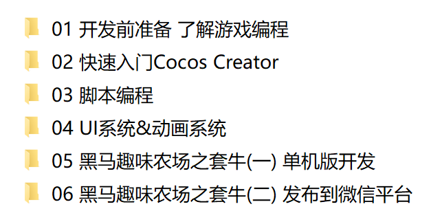

## 1. 微信小游戏现状

​	小游戏发展至今，月活跃用户达到4亿多，跟中国当前移动游戏活跃用户数相当。跳一跳的活跃用户目前还超过千万。

​	相比较传统的端游，小游戏具备开发周期短，成本低，易于推广等好处。

## 2. 为什么选择Cocos Creator ？

​	本课程选择的游戏引擎和编程语言 是 Cocos2d的升级版 CocosCreator + JavaScript。

​	选择的理由，市场份额最大，文档资料齐全，支持多平台，包括对微信小游戏，支付宝小游戏，百度小游戏等新的游戏平台的支持。

## 3. 学习完本课程将解锁什么能力 ？

本课程主要是针对微信小游戏的开发，从入门到完成一个完整的小游戏的开发，再到整体打包发布到微信平台。

一共是6天的课程安排：通过6天的学习就可以独立完成一个小游戏并上架微信平台。

## 4. 学习小游戏开发需要的基础？

只需要掌握一门编程语言的基本语法就可以学习。